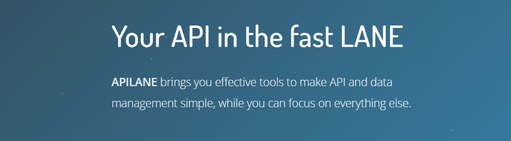

[](https://hub.docker.com/r/raptis/apilane/tags) [](https://www.nuget.org/packages/Apilane.Net) 




# What Is Apilane?

Apilane is a backend platform that provides tools for developing and managing APIs for mobile and web client applications.
It offers features such as database management, user authentication, file storage and more, aiming to simplify backend development.


# Why Apilane?

* **Rapid Development**: Apilane provides pre-built backend services, such as user authentication, database management and file storage.
This eliminates the need to develop these functionalities from scratch, allowing developers to focus more on building and refining the frontend of their applications.

* **Scalability**: Apilane is designed to handle scalability challenges inherent in modern applications, powered by [Microsoft Orleans](https://learn.microsoft.com/en-us/dotnet/orleans/) for distributed actor state management.
This scalability ensures that applications remain responsive and available even as they grow in popularity and usage.

* **Simplicity**: Apilane abstracts away the complexity of backend development by providing easy-to-use API.
Developers can quickly integrate backend services into their applications without needing extensive backend development expertise.

* **Security**: Apilane implements robust security measures, including role-based access controls, IP allow/block lists, sliding window rate limiting, and data encryption.

* **Storage providers**: Out of the box support for [SQLite](https://en.wikipedia.org/wiki/SQLite), [SQL Server](https://en.wikipedia.org/wiki/Microsoft_SQL_Server), [MySQL](https://en.wikipedia.org/wiki/MySQL) and [PostgreSQL](https://en.wikipedia.org/wiki/PostgreSQL).

# Quick Start

Execute the provided [docker-compose.yaml](docs/docs/assets/docker-compose.yaml) using the command:

```bash
docker-compose -p apilane up -d
```

This will set up the Portal and the API services on Docker.
You may then access the portal on [http://localhost:5000](http://localhost:5000) with default credentials:

- **Email**: `admin@admin.com`
- **Password**: `admin`

# .NET SDK

Install the [Apilane.Net](https://www.nuget.org/packages/Apilane.Net) NuGet package to integrate with Apilane from any .NET application:

```bash
dotnet add package Apilane.Net
```

See the [SDK documentation](https://docs.apilane.com/developer_guide/sdk/) for usage examples.

# Documentation

For more info check [our docs](https://docs.apilane.com).
