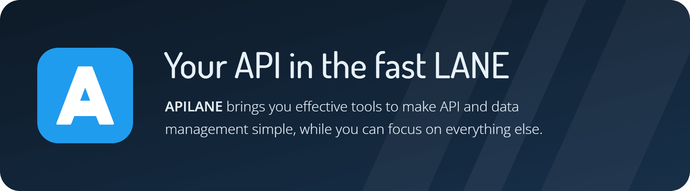
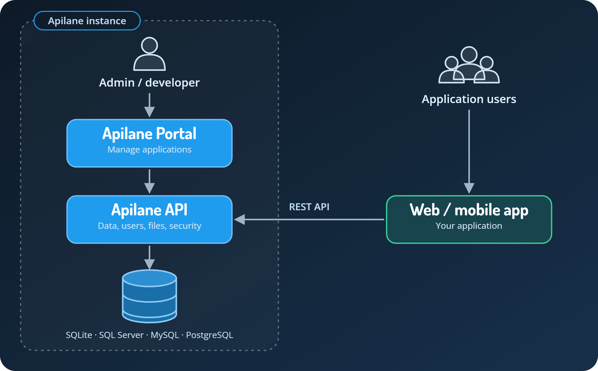

[](https://hub.docker.com/r/raptis/apilane/tags) [](https://www.nuget.org/packages/Apilane.Net) 




# What Is Apilane?

Apilane is a backend platform that provides tools for developing and managing APIs for mobile and web client applications.
It offers features such as database management, user authentication, file storage and more, aiming to simplify backend development.



# Why Apilane?

* **Rapid Development**: Apilane provides pre-built backend services, such as user authentication, database management and file storage.
This eliminates the need to develop these functionalities from scratch, allowing developers to focus more on building and refining the frontend of their applications.

* **Scalability**: Apilane is designed to handle scalability challenges inherent in modern applications, powered by [Microsoft Orleans](https://learn.microsoft.com/en-us/dotnet/orleans/) for distributed actor state management.
This scalability ensures that applications remain responsive and available even as they grow in popularity and usage.

* **Simplicity**: Apilane abstracts away the complexity of backend development by providing easy-to-use API.
Developers can quickly integrate backend services into their applications without needing extensive backend development expertise.

* **Security**: Apilane implements robust security measures, including role-based access controls, IP allow/block lists, sliding window rate limiting, and data encryption.

* **Storage providers**: Out of the box support for [SQLite](https://en.wikipedia.org/wiki/SQLite), [SQL Server](https://en.wikipedia.org/wiki/Microsoft_SQL_Server), [MySQL](https://en.wikipedia.org/wiki/MySQL) and [PostgreSQL](https://en.wikipedia.org/wiki/PostgreSQL). File storage supports local file system, Google Cloud Storage, AWS S3, and Azure Blob Storage.

# Quick Start

Execute the provided [docker-compose.yaml](docs/docs/assets/docker-compose.yaml). The Portal and the API authenticate each other with a shared **installation key**. The first command below generates a long random one into a `.env` file next to the compose file, only if it is not there yet; the second starts the services:

```bash
grep -qs "^APILANE_INSTALLATION_KEY=." .env || echo "APILANE_INSTALLATION_KEY=$(openssl rand -hex 32)" >> .env
docker-compose -p apilane up -d
```

Keep the `.env` file for every later `docker-compose up`: the Portal stores the key on first start, so a different value would lock the API out. Never use an example value from documentation or a public repository as the key: it is the only thing standing between the network and every application's configuration.

This will set up the Portal and the API services on Docker.
You may then access the portal on [http://localhost:5000](http://localhost:5000) with default credentials:

- **Email**: `admin@admin.com`
- **Password**: `admin`

# .NET SDK

Install the [Apilane.Net](https://www.nuget.org/packages/Apilane.Net) NuGet package to integrate with Apilane from any .NET application:

```bash
dotnet add package Apilane.Net
```

See the [SDK documentation](https://docs.apilane.com/developer_guide/sdk/) for usage examples.

# Documentation

For more info check [our docs](https://docs.apilane.com).

The Portal (its UI and the management API under `/api/v1`) is documented in [src/Apilane.Portal.Ui/README.md](src/Apilane.Portal.Ui/README.md): how it behaves, how to run, build and deploy it, and how to call its API.

# License

Apilane is licensed under the [GNU Affero General Public License v3.0](LICENSE).

The client SDKs under [sdk/](sdk) ([Apilane.Net](sdk/Apilane.Net) and [Apilane.Js](sdk/Apilane.Js)) are the exception: they are licensed under the [MIT License](sdk/LICENSE).
