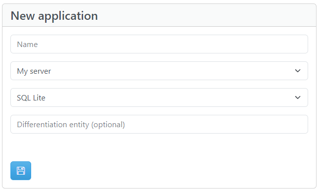

# Application

An application is the backend of your client application.
To create a new Application you need to define:

- Name - The display name of the Application.
- Server - The Server where the Application is going to be created/deployed.
- Storage provider - See [Storage providers](/developer_guide/storage_providers).
- Differentiation entity (optional) - See [Differentiation entity](#differentiation-entity).

## Differentiation entity

A differentiation entity allows you to conceptually "split" data on the application entities, depending on a system property on the system entity `Users`.

!!!info "Note"
    The main use of the differentiation entity is to enable access to a record, only for users that share the same value on that property.

!!!warning "Warning"
    The differentiation entity can be defined **only** when creating the application and cannot be edited or deleted later.

For example, if you are building an application that is shared between multiple companies, you can set a differentiation entity named `Company`. Then, each user will have access only on records of the company they are assigned to.

 It is a client application concern to decide how to assign values to that differentiation entity property for each user. For example, the application developer can use a [Custom endpoint](/developer_guide/custom_endpoints) to assign the proper differentiation property value to a new user, depending on application needs.

### Example

A new Application is created with Differantiation entity `Company`. Apart from the typical system entities, a new entity is created named `Company`. Additionaly on system entity `Users` there is an extra system property named `Company_ID`.

Every new user that is registered to the application, will by default be assigned the value `null` on the differentiation property `Company_ID`.

On every subsequent entity that is created, there is the option to add a differentiation property or not. That is because some entites may hold data that should be common for all companies. On entities that this option is enabled, an extra system property named `Company_ID` will appear.

Assuming we have 2 users, User_A with `Company_ID=null` and User_B with `Company_ID=1`. If User_A creates a record on a differentiated entity, the record column `Company_ID` will have value `null`. If User_B creates a record on a differentiated entity, the record column `Company_ID` will have value `1`. Subsequently all users with value null will have access only to records with that value and users with value 1 will have access only to records with that value.