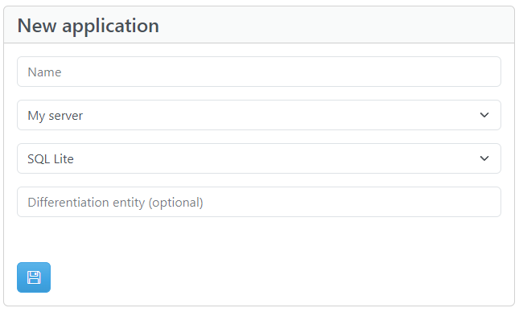

# Application

An application is the backend of your client application. It encapsulates your data model (entities), security rules, file storage, email configuration, custom endpoints, and reports.

## Create

To create a new Application you need to define:

| Setting | Required | Description |
|---|---|---|
| **Name** | Yes | Display name (4–100 characters, e.g., "MyApp") |
| **Server** | Yes | The [Server](server_overview.md) where the application will be deployed |
| **Storage provider** | Yes | Database type — see [Storage providers](storage_providers.md) |
| **Differentiation entity** | No | Optional multi-tenant data isolation — see [below](#differentiation-entity) |

Upon creation, the application receives:

- A unique **Application Token** (GUID) — used to identify the application in every API request
- An **Encryption Key** — used for encrypting sensitive data
- Default system entities: `Users` and `Files`

---

## Application settings

After creating an application, you can configure these settings from the Portal:

### Authentication

| Setting | Default | Description |
|---|---|---|
| **Auth token expiration** | varies | Minutes of **inactivity** before an authentication token expires. Each authenticated request resets the timer. Range: 1 to 2,147,483,647 |
| **Force single login** | `false` | If enabled, each new login invalidates all previous auth tokens for that user |
| **Allow unconfirmed email login** | `true` | If disabled, users must confirm their email before they can log in |
| **Allow new user registration** | `true` | If disabled, no new users can register via the API |

### Files

| Setting | Default | Description |
|---|---|---|
| **Max file size** | varies | Maximum allowed file size in KB. Range: 1 KB to 25,600 KB (25 MB) |

### Email

SMTP settings for sending confirmation and password reset emails. See [Email Templates](email_templates.md) for details.

| Setting | Description |
|---|---|
| **Mail server** | SMTP server hostname |
| **Mail server port** | SMTP port (1–65535) |
| **Mail from address** | Sender email address |
| **Mail from display name** | Sender display name |
| **Mail username** | SMTP authentication username |
| **Mail password** | SMTP authentication password |

### Networking

| Setting | Description |
|---|---|
| **Online** | Whether the application is currently accepting API requests |
| **IP allow/block** | Restrict access by IP address — see [Security](security.md#ip-allowblock) |

### Advanced

| Setting | Description |
|---|---|
| **Email confirmation redirect URL** | Where the browser redirects after a user confirms their email (max 10,000 characters) |
| **Connection string** | Database connection string (for SQL Server and MySQL) |

---

## Differentiation entity

A differentiation entity allows you to conceptually "split" data on the application entities, depending on a system property on the system entity `Users`.

!!!info "Note"
    The main use of the differentiation entity is to enable access to a record only for users that share the same value on that property.

!!!warning "Warning"
    The differentiation entity can be defined **only** when creating the application and cannot be edited or deleted later.

### How it works

For example, if you are building an application shared between multiple companies, you can set a differentiation entity named `Company`. Then, each user will have access only to records of the company they are assigned to.

When a differentiation entity is set:

1. A new entity is created with that name (e.g., `Company`)
2. The `Users` entity gets an extra system property named `{Entity}_ID` (e.g., `Company_ID`)
3. Every subsequent entity you create has the option to include a differentiation property
4. On every API call, Apilane automatically appends a filter based on the user's differentiation value

It is a client application concern to decide how to assign values to that differentiation entity property for each user. For example, the application developer can use a [Custom endpoint](custom_endpoints.md) to assign the proper differentiation property value to a new user, depending on application needs.

### Example

A new Application is created with Differentiation entity `Company`. Apart from the typical system entities, a new entity is created named `Company`. Additionally, on system entity `Users` there is an extra system property named `Company_ID`.

Every new user that is registered to the application, will by default be assigned the value `null` on the differentiation property `Company_ID`.

On every subsequent entity that is created, there is the option to add a differentiation property or not. That is because some entities may hold data that should be common for all companies. On entities where this option is enabled, an extra system property named `Company_ID` will appear.

| User | `Company_ID` | Access Scope |
|---|---|---|
| User_A | `null` | Only records where `Company_ID` is `null` |
| User_B | `1` | Only records where `Company_ID` is `1` |
| User_C | `1` | Only records where `Company_ID` is `1` |

If User_A creates a record on a differentiated entity, the record column `Company_ID` will have value `null`. If User_B creates a record, the record column `Company_ID` will have value `1`. Subsequently, all users with the same differentiation value will see only their group's records.

---

## Application lifecycle

| Action | Description |
|---|---|
| **Create** | Define name, server, storage provider, and optional differentiation entity |
| **Edit** | Update settings (authentication, email, IP rules, etc.) from the Portal |
| **Clone** | Create a copy of an existing application |
| **Delete** | Permanently remove the application and all its data |
| **Toggle Online** | Bring the application online/offline without deleting it |

## Collaboration

Applications support a collaboration model where multiple Portal users can manage the same application. The application owner can invite collaborators through the Portal.
