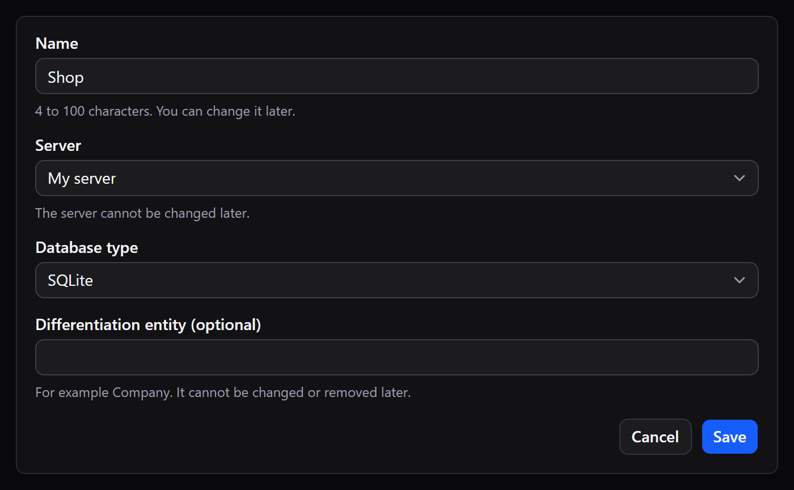

# Application

An application is the backend of your client application. It encapsulates your data model (entities), security rules, file storage, email configuration, custom endpoints, and reports.

## Create

To create a new Application, open **Applications** in the Portal and click **New application**. You need to define:

| Setting | Required | Description |
|---|---|---|
| **Name** | Yes | Display name (4–100 characters, e.g., "MyApp") |
| **Server** | Yes | The [Server](server_overview.md) where the application will be deployed |
| **Database type** | Yes | Where the application's data lives — see [Storage providers](storage_providers.md). SQL Server, MySQL and PostgreSQL also need a **Connection string** |
| **Differentiation entity** | No | Optional multi-tenant data isolation — see [below](#differentiation-entity) |

Upon creation, the application receives:

- A unique **Application Token** (GUID) — used to identify the application in every API request
- An **Encryption Key** (8 characters) — used for encrypting sensitive data. The token, the API server address and the key are shown under **Info** (a button on the application's screens, and in the menu of its card)
- The system entities `Users`, `AuthTokens` (read-only: the sign-in tokens) and `Files`, plus the differentiation entity if you named one
- A default report, "User registrations per day", on the **Reports** tab

In the Portal the application opens on its tabs: **Entities**, **Data**, **Security**, **Custom endpoints**, **Email**, **Reports**, **Sharing** (owner only), **Import**, **Audit log** (who changed what in the Portal) and **Settings**.

---

## Application settings

After creating an application, you can configure these settings on its tabs in the Portal: authentication, files and IP access on the **Security** tab, mail on the **Email** tab, and the name, connection string and online status on the **Settings** tab.

### Authentication

| Setting | Default | Description |
|---|---|---|
| **Auth token lifetime (minutes)** | `60` | Minutes of **inactivity** before an authentication token expires. A request extends the token, but only once more than 10% of the lifetime has passed since it was last extended, so the real window can be up to 10% shorter. Range: 1 to 2,147,483,647 |
| **Allow only one sign-in at a time** | `false` | If enabled, each new login invalidates all previous auth tokens for that user |
| **Allow users with an unconfirmed email to sign in** | `true` | If disabled, users must confirm their email before they can log in |
| **Allow new users to register** | `true` | If disabled, no new users can register via the API |

### Files

| Setting | Default | Description |
|---|---|---|
| **Maximum file size (KB)** | `100` | Maximum allowed file size in KB. Range: 1 KB to 25,600 KB (25 MB). A new application accepts files up to 100 KB until you raise it |

### Email

SMTP settings for sending confirmation and password reset emails. See [Email Templates](email_templates.md) for details. All six fields are needed: with any of them empty the application sends no mail, and the **Email** tab shows "Incomplete".

| Setting | Description |
|---|---|
| **Mail server** | SMTP server hostname |
| **Port** | SMTP port (1–65535) |
| **Sender address** | Sender email address |
| **Sender display name** | Sender display name |
| **User name** | SMTP authentication username |
| **Password** | SMTP authentication password. Once saved it is never shown again; an empty box keeps the stored value |

### Networking

| Setting | Description |
|---|---|
| **Online** | Whether the application is currently accepting API requests (**Settings** tab: **Take offline** / **Bring online**) |
| **IP access** | Restrict access by IP address — see [Security](security.md#ip-allowblock) |

### Advanced

| Setting | Description |
|---|---|
| **Redirect URL** (**Email** tab, 'Email confirmation landing page') | Where the browser redirects after a user confirms their email (max 10,000 characters). Empty: a default page of the Portal |
| **Connection string** (**Settings** tab) | Database connection string (for SQL Server, MySQL and PostgreSQL). Once saved it is never shown again; an empty box keeps the stored value. A new value moves no data: it must point to the database that already holds the application's tables, and it is not checked when you save, so a wrong one shows when the application is next called. The server and the database type cannot be changed (to move an application, [clone](#application-lifecycle) it) |

---

## Differentiation entity

A differentiation entity allows you to conceptually "split" data on the application entities, depending on a system property on the system entity `Users`.

!!!info "Note"
    The main use of the differentiation entity is to enable access to a record only for users that share the same value on that property.

!!!warning "Warning"
    The differentiation entity can be defined **only** when creating the application and cannot be edited or deleted later.

### How it works

For example, if you are building an application shared between multiple companies, you can set a differentiation entity named `Company`. Then, each user will have access only to records of the company they are assigned to.

When a differentiation entity is set:

1. A new entity is created with that name (e.g., `Company`)
2. The `Users` and `Files` entities get an extra system property named `{Entity}_ID` (e.g., `Company_ID`). It cannot be written through the Data API
3. Every subsequent entity you create has the option to include a differentiation property
4. On every Data, Files and Stats call on an entity that has the differentiation property, Apilane automatically appends a filter based on the user's differentiation value. The people who manage the application in the Portal are not filtered, and [custom endpoints](custom_endpoints.md) get no automatic filter: write the condition in your SQL

It is a client application concern to decide how to assign values to that differentiation entity property for each user. For example, the application developer can use a [Custom endpoint](custom_endpoints.md) to assign the proper differentiation property value to a new user, depending on application needs.

Name the differentiation entity with letters only (a–z, A–Z), up to 40 characters: the name becomes a table name and part of the property name `{Name}_ID`. The differentiation entity is a system entity: it cannot be renamed or deleted, it has record change tracking on, and it starts with `ID` and `Created`, so add your own properties to it (for example a `Name`) on its **Properties** page.

### Example

A new Application is created with Differentiation entity `Company`. Apart from the typical system entities, a new entity is created named `Company`. Additionally, on system entity `Users` there is an extra system property named `Company_ID`.

Every new user that is registered to the application, will by default be assigned the value `null` on the differentiation property `Company_ID`.

On every subsequent entity that is created, there is the option to add a differentiation property or not. That is because some entities may hold data that should be common for all companies. On entities where this option is enabled, an extra system property named `Company_ID` will appear.

| User | `Company_ID` | Access Scope |
|---|---|---|
| User_A | `null` | Only records where `Company_ID` is `null` |
| User_B | `1` | Only records where `Company_ID` is `1` |
| User_C | `1` | Only records where `Company_ID` is `1` |

If User_A creates a record on a differentiated entity, the record column `Company_ID` will have value `null`. If User_B creates a record, the record column `Company_ID` will have value `1`. Subsequently, all users with the same differentiation value will see only their group's records.

---

## Application lifecycle

| Action | Description |
|---|---|
| **Create** | Define name, server, database type, and optional differentiation entity |
| **Edit** | Update settings (authentication, email, IP rules, etc.) on the **Security**, **Email** and **Settings** tabs |
| **Clone** | Create a copy of an existing application on the server and database you choose (menu of the application's card), with or without its records. The copy has a new token and the same encryption key, is named "… - Clone" and is owned by you. Reports, sharing and uploaded files are not copied. Records are copied in the background and a progress page follows it |
| **Export** | **Export** in the menu of the application's card downloads a zip of the application's folder on the API server. Its `application.json` has the mail settings, the connection string and the sharing blanked, but keeps the encryption key. The zip also holds the SQLite database file (for SQLite applications) and the uploaded files (with local file storage), so handle it like the data itself |
| **Import application** | **Import application** on the Applications page creates an application from the `application.json` inside an export (unzip it first). Only the definition is imported — entities, properties, constraints, custom endpoints, security rules and reports — not records, files, mail settings or the connection string. The token and the encryption key of the file are kept, so no application with that token may exist in the instance. (The **Import** tab inside an application is a different thing: [Schema Import](schema_import.md).) |
| **Take offline / Bring online** | Stop or resume accepting API requests without deleting anything |
| **Rebuild** | Drop all data and create the tables again, empty (**Settings** tab, Danger zone, or the menu of the application's card). The token, entities and properties stay. On SQL Server, MySQL and PostgreSQL it drops **every** table of the connected database, not only Apilane's, so give the application a database of its own |
| **Delete** | Permanently remove the application, its entities, properties, custom endpoints, reports and sharing, and its data on the API server (**Settings** tab, Danger zone, or the menu of the application's card). On SQL Server, MySQL and PostgreSQL every table of the database is dropped and the empty database stays. Files kept in cloud storage are not deleted |

## Collaboration

Applications support a collaboration model where multiple Portal users can manage the same application. The application owner shares it on the **Sharing** tab, by entering the email address of another Portal user exactly as in that user's account. A collaborator can do everything the owner can, even delete the application, except sharing it. You can also share an application with an **agent**: an account for a script or an AI agent, created by an administrator under **Instance > Users**, whose address ends in `@agent.local`. An agent calls the Portal's management API with a key, is not notified by email, and cannot delete or rebuild the application.
