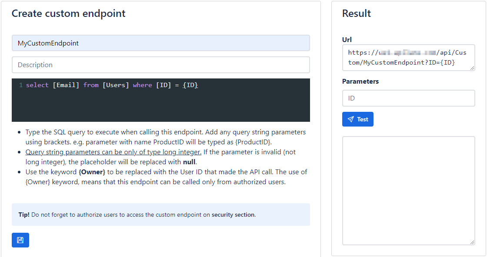

# Custom endpoints

Custom endpoints offer an easy and direct way to expose complex functionality for your application. The logic is simple.

- You provide a name for the custom endpoint e.g. `MyCustomEndpoint`.
- You write the query to be executed against the storage provider (most probably an SQL query) e.g. `select [Email] from [Users] where [ID] = {ID}`.
- Your query may accept inputs as query parameters, which are automatically binded, if you wrap your parameter withs brackets, e.g. the `{ID}` on the above example.
- You provide access to the custom endpoint through [security](/developer_guide/security) management .
- You can now call this endpoint, providing any required parameters e.g. `GET https://my.api.com/api/Custom/MyCustomEndpoint?ID={ID}`.

!!!info "Note"
    Parameters can only be of type big integer (long) to avoid sql injection vulnerabilities.
    
!!!info "Note"
    All custom endpoints are plain http GET requests.

