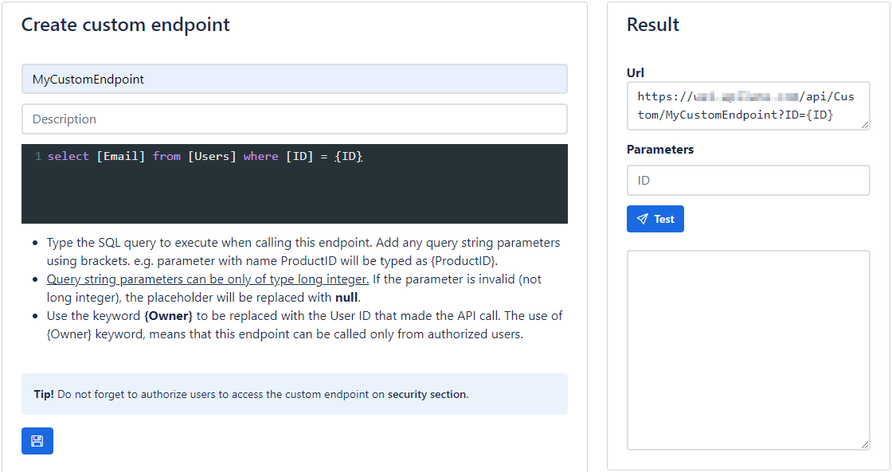

# Custom Endpoints

Custom endpoints offer an easy and direct way to expose complex functionality for your application by running SQL queries as API endpoints.

## How It Works

1. **Name** your endpoint — e.g., `GetActiveUsers`
2. **Write the SQL query** to execute against the storage provider — e.g., `SELECT [Email], [Username] FROM [Users] WHERE [ID] = {UserID}`
3. **Define parameters** by wrapping names in curly braces — e.g., `{UserID}` becomes a query parameter
4. **Configure access** through the [Security](security.md) settings
5. **Call the endpoint** — `GET https://my.api.server/api/Custom/GetActiveUsers?appToken={appToken}&UserID=42`



## Parameters

Parameters in your SQL query are wrapped in `{braces}` and are automatically bound from the request's query string.

**Example query:**

```sql
SELECT [Name], [Price] FROM [Products] WHERE [CategoryID] = {CategoryID} AND [ID] > {MinID}
```

**API call:**

```
GET https://my.api.server/api/Custom/GetProducts?appToken={appToken}&CategoryID=5&MinID=100
```

!!!warning "Type restriction"
    Parameters can only be of type **big integer (long)** to prevent SQL injection vulnerabilities. String parameters are not supported.

!!!info "HTTP method"
    All custom endpoints are plain HTTP **GET** requests.

## Multiple Result Sets

A custom endpoint can contain multiple SQL statements separated by semicolons. Each statement returns a separate result set:

```sql
SELECT [ID], [Name] FROM [Categories] WHERE [ID] = {CatID};
SELECT [ID], [Name], [Price] FROM [Products] WHERE [CategoryID] = {CatID}
```

The response is a nested array — one array per result set:

```json
[
  [{ "ID": 5, "Name": "Electronics" }],
  [
    { "ID": 1, "Name": "Widget", "Price": 9.99 },
    { "ID": 2, "Name": "Gadget", "Price": 19.99 }
  ]
]
```

## Security

Custom endpoint access is managed separately from entity security. Navigate to **Security** in the Portal and configure which roles can access each custom endpoint.

See [Security > Custom endpoints](security.md#custom-endpoints) for more details.

## SDK Usage

```csharp
// Single result set
var result = await _apilaneService.GetCustomEndpointAsync<List<Product>>(
    CustomEndpointRequest.New("GetProducts")
        .WithAuthToken(authToken)
        .WithParameter("CategoryID", 5));

// Multiple result sets
var (categories, products) = await _apilaneService
    .GetCustomEndpointAsync<List<Category>, List<Product>>(
        CustomEndpointRequest.New("GetCategoryWithProducts")
            .WithAuthToken(authToken)
            .WithParameter("CatID", 5));
```
