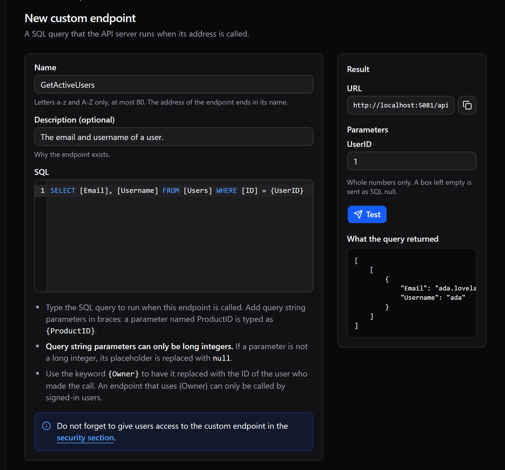

# Custom Endpoints

Custom endpoints offer an easy and direct way to expose complex functionality for your application by running SQL queries as API endpoints.

## How It Works

1. **Name** your endpoint — e.g., `GetActiveUsers`. A name has letters a-z and A-Z only, at most 80, and is matched ignoring case. The address of the endpoint ends in it
2. **Write the SQL query** to execute against the storage provider — e.g., `SELECT [Email], [Username] FROM [Users] WHERE [ID] = {UserID}`
3. **Define parameters** by wrapping names in curly braces — e.g., `{UserID}` becomes a query parameter
4. **Configure access** through the [Security](security.md) settings
5. **Call the endpoint** — `GET https://my.api.server/api/Custom/GetActiveUsers?UserID=42` (with `x-application-token` header)



Custom endpoints are created on the **Custom endpoints** tab of the application in the Portal (**New endpoint**). The editor shows the address and the parameters as you type, and **Test** runs the query with the values you enter. The **Help** button in the header of the editor explains the query, the parameters and the test.

!!!info "Quoting names"
    The query is sent to your database as it is written, so quote names the way that database does: `[Name]` on SQL Server and SQLite, `` `Name` `` on MySQL and `"Name"` on PostgreSQL. The examples on this page use square brackets.

## Parameters

Parameters in your SQL query are wrapped in `{braces}` and are automatically bound from the request's query string.

**Example query:**

```sql
SELECT [Name], [Price] FROM [Products] WHERE [CategoryID] = {CategoryID} AND [ID] > {MinID}
```

**API call:**

```
GET https://my.api.server/api/Custom/GetProducts?CategoryID=5&MinID=100
x-application-token: {appToken}
```

A parameter name has letters and underscores only (`{Category_ID}`, not `{ID2}`), and the query string must spell it exactly as the SQL does, capitals included. A parameter that is missing, or whose value is not a whole number, is replaced by `null` in the SQL.

!!!warning "Type restriction"
    Parameters can only be of type **big integer (long)** to prevent SQL injection vulnerabilities. String parameters are not supported.

!!!info "HTTP method"
    All custom endpoints are plain HTTP **GET** requests.

### The caller: `{Owner}`

The keyword `{Owner}` is replaced by the ID of the signed-in user who made the call, so an endpoint can return or change only the caller's own data:

```sql
SELECT [ID], [Title] FROM [Orders] WHERE [Owner] = {Owner}
```

`{Owner}` is not a query string parameter and cannot be set by the caller. For a call without a signed-in user it is not replaced and the database refuses the query. **Test** in the Portal does not replace it either: put a user ID in its place to try the query.

## Multiple Result Sets

A custom endpoint can contain multiple SQL statements separated by semicolons. Each statement returns a separate result set:

```sql
SELECT [ID], [Name] FROM [Categories] WHERE [ID] = {CatID};
SELECT [ID], [Name], [Price] FROM [Products] WHERE [CategoryID] = {CatID}
```

The response is always a list of result sets, one array per result set (a query with a single statement gives `[[ {...}, {...} ]]`):

```json
[
  [{ "ID": 5, "Name": "Electronics" }],
  [
    { "ID": 1, "Name": "Widget", "Price": 9.99 },
    { "ID": 2, "Name": "Gadget", "Price": 19.99 }
  ]
]
```

## Writes, transactions and limits

The SQL can be anything your database runs, inserts, updates and deletes included, and it is still called with a plain GET. A call runs inside a transaction: if the query fails nothing it did is kept, if it succeeds the changes are committed. The call has **20 seconds**, after which the transaction is cancelled and nothing is kept. Called as an operation of a [transaction](transactions.md), it is part of that transaction and has its time.

- **Test** in the Portal runs the query as it is in the editor and **never commits**: whatever it changes is rolled back. On MySQL a statement that changes tables or columns (CREATE, ALTER, DROP, TRUNCATE, RENAME) is committed at once, even in a test, and cannot be undone.
- Do not use `BEGIN`, `COMMIT` or `ROLLBACK` in the query, and do not create or drop tables and columns: the application would no longer match its definition.
- A query that writes does not get the checks of the standard calls, such as minimum and maximum values, validation patterns, encryption of encrypted properties and change tracking. Check what you write yourself.
- On SQLite, statements that reach outside the database of the application, such as `ATTACH` or most `PRAGMA`, are refused.

## Security

Custom endpoint access is managed separately from entity security. Open the **Security** tab of the application in the Portal and configure which roles can access each custom endpoint. Until a rule allows the caller, every call to the endpoint is refused (`UNAUTHORIZED`). The rules are written for the name of the endpoint: after a rename they no longer apply and must be set again.

See [Security > Custom endpoints](security.md#custom-endpoints) for more details.

## SDK Usage

```csharp
// Single result set
var result = await _apilaneService.GetCustomEndpointAsync<List<Product>>(
    CustomEndpointRequest.New("GetProducts")
        .WithAuthToken(authToken)
        .WithParameter("CategoryID", 5));

// Multiple result sets
var result = await _apilaneService
    .GetCustomEndpointAsync<List<Category>, List<Product>>(
        CustomEndpointRequest.New("GetCategoryWithProducts")
            .WithAuthToken(authToken)
            .WithParameter("CatID", 5));

var (categories, products) = result.Match(
    data => data,
    error => throw new Exception(error.Message));
```
