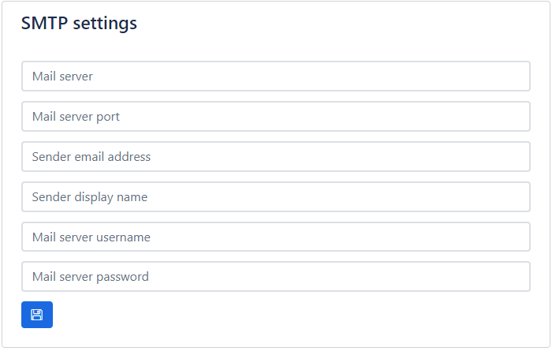
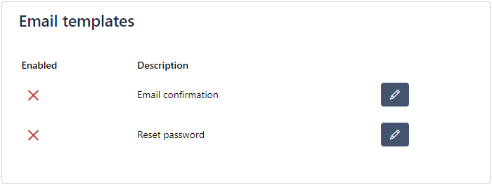
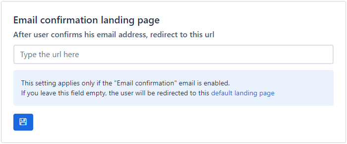

# Email templates

Each application can be customized to send an email to users upon registration or to facilitate the "forget password" mechanism.

Visit the Email section of the application and update the SMTP settings.

Enable/disable and edit the body and topic of the available email templates.

- **Email confirmation**
	- If that template is enabled, an email is sent to the user after registration. The email is usually a welcome message and usually contains a url to confirm the user email. The actual url is generated from Apilane and there is a predefined placeholder string to be set wherever you like inside the email body.
- **Reset password**
	- If that template is enabled, an email is sent to the user upon request to reset password. The email should contain the url to that the user should follow to reset the password. The actual url is generated from Apilane and there is a predefined placeholder string to be set wherever you like inside the email body.

After a user confirms the email by following the url provided on the email, the browser should eventually land somewhere. There is a default landing page for each application. This landing page can be configured to a url of your choice.

