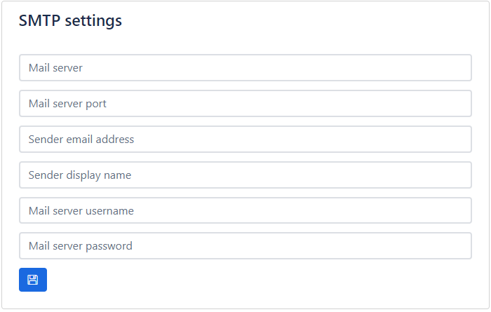
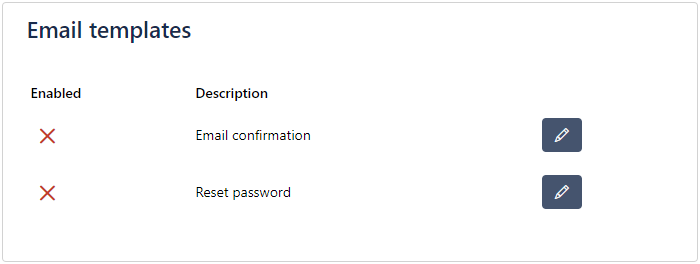
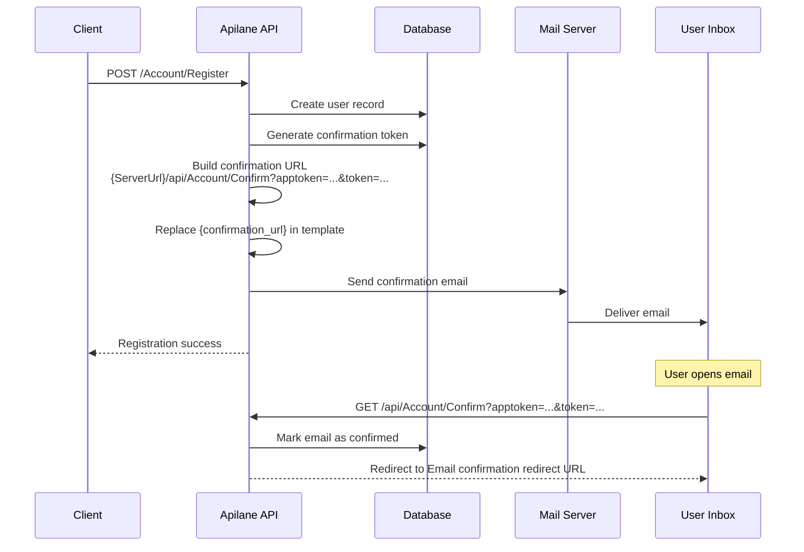
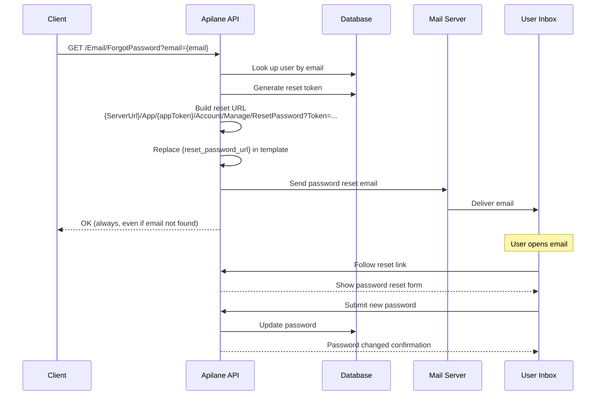
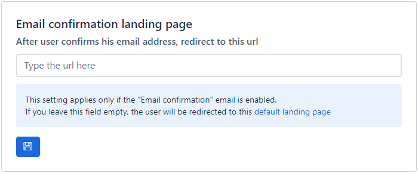

# Email templates

Apilane supports sending emails to users for account-related events such as registration confirmation and password recovery. Each application can be configured with its own SMTP settings and customizable email templates.

---

## SMTP configuration

Before emails can be sent, you must configure the SMTP settings for your application. Navigate to the **Email** section of your application in the Portal.

| Setting | Description |
|---|---|
| **Mail server** | SMTP server hostname (e.g., `smtp.gmail.com`) |
| **Mail server port** | SMTP port — typically `587` (TLS) or `465` (SSL) |
| **Mail from address** | The "From" email address shown to recipients |
| **Mail from display name** | The display name shown alongside the from address |
| **Mail username** | SMTP authentication username |
| **Mail password** | SMTP authentication password |



!!!warning "Required for email features"
    All SMTP fields must be configured for email functionality to work. If any field is missing, email operations will fail with a "Missing application SMTP settings" error.

---

## Available templates

Apilane provides two built-in email templates. Each can be individually enabled or disabled, and both the subject and body can be fully customized.

### Email confirmation

Sent to the user after registration. Typically contains a welcome message and a link to confirm the user's email address.

- **Event code**: `UserRegisterConfirmation`
- **Default subject**: `Welcome!`
- **Default body**: `Thank you for creating an account. Please click on this link to confirm your email address`

### Reset password

Sent to the user when they request a password reset via the `ForgotPassword` API endpoint.

- **Event code**: `UserForgotPassword`
- **Default subject**: `Reset Password`
- **Default body**: `Please click on this link to reset your password`



---

## Template placeholders

Customize your email templates using placeholders. Apilane replaces these with actual values when sending the email.

### User placeholders

These placeholders are available in **all** email templates:

| Placeholder | Description |
|---|---|
| `{Users.ID}` | The user's ID |
| `{Users.Username}` | The user's username |
| `{Users.Email}` | The user's email address |

### Event-specific placeholders

Each email event has its own special placeholder:

| Event | Placeholder | Description |
|---|---|---|
| Email confirmation | `{confirmation_url}` | The URL the user must follow to confirm their email address |
| Reset password | `{reset_password_url}` | The URL the user must follow to reset their password |

### Example template

```html
Hello {Users.Username},

Thank you for joining our platform!

Please click on this <a href="{confirmation_url}">link</a> to confirm 
your email address.

Best regards,
The Team
```

---

## Confirmation flow

When a user registers and email confirmation is enabled:


```mermaid
sequenceDiagram
    participant Client
    participant API as Apilane API
    participant DB as Database
    participant SMTP as Mail Server
    participant User as User Inbox

    Client->>API: POST /Account/Register
    API->>DB: Create user record
    API->>DB: Generate confirmation token
    API->>API: Build confirmation URL<br/>{ServerUrl}/api/Account/Confirm?apptoken=...&token=...
    API->>API: Replace {confirmation_url} in template
    API->>SMTP: Send confirmation email
    SMTP->>User: Deliver email
    API-->>Client: Registration success
    Note over User: User opens email
    User->>API: GET /api/Account/Confirm?apptoken=...&token=...
    API->>DB: Mark email as confirmed
    API-->>User: Redirect to Email confirmation redirect URL
```

1. User registers via `POST /Account/Register`
2. Apilane generates a unique confirmation token
3. The confirmation URL is built as: `{ServerUrl}/api/Account/Confirm?apptoken={token}&token={confirmationToken}`
4. The `{confirmation_url}` placeholder is replaced with this URL in the email template
5. The email is sent to the user
6. When the user clicks the link, their email is marked as confirmed
7. The browser redirects to the **Email confirmation redirect URL** (configurable in [Application settings](application.md#application-settings))

!!!info "Re-sending confirmation"
    If a user loses their initial confirmation email, they can request a new one via the `Email/RequestConfirmation` API endpoint.

---

## Password reset flow

When a user requests a password reset:


```mermaid
sequenceDiagram
    participant Client
    participant API as Apilane API
    participant DB as Database
    participant SMTP as Mail Server
    participant User as User Inbox

    Client->>API: GET /Email/ForgotPassword?email={email}
    API->>DB: Look up user by email
    API->>DB: Generate reset token
    API->>API: Build reset URL<br/>{ServerUrl}/App/{appToken}/Account/Manage/ResetPassword?Token=...
    API->>API: Replace {reset_password_url} in template
    API->>SMTP: Send password reset email
    SMTP->>User: Deliver email
    API-->>Client: OK (always, even if email not found)
    Note over User: User opens email
    User->>API: Follow reset link
    API-->>User: Show password reset form
    User->>API: Submit new password
    API->>DB: Update password
    API-->>User: Password changed confirmation
```

1. Client calls `GET /Email/ForgotPassword?email={email}`
2. Apilane generates a unique reset token
3. The reset URL is built as: `{ServerUrl}/App/{appToken}/Account/Manage/ResetPassword?Token={resetToken}`
4. The `{reset_password_url}` placeholder is replaced in the email template
5. The email is sent to the user
6. The user follows the link to set a new password

!!!info "Security note"
    Both `RequestConfirmation` and `ForgotPassword` endpoints return success even if the email does not exist in the system. This prevents email enumeration attacks.

---

## Confirmation landing page

After a user confirms their email by following the URL provided in the email, the browser eventually lands on a page. There is a default landing page for each application. This landing page can be configured to a URL of your choice.


