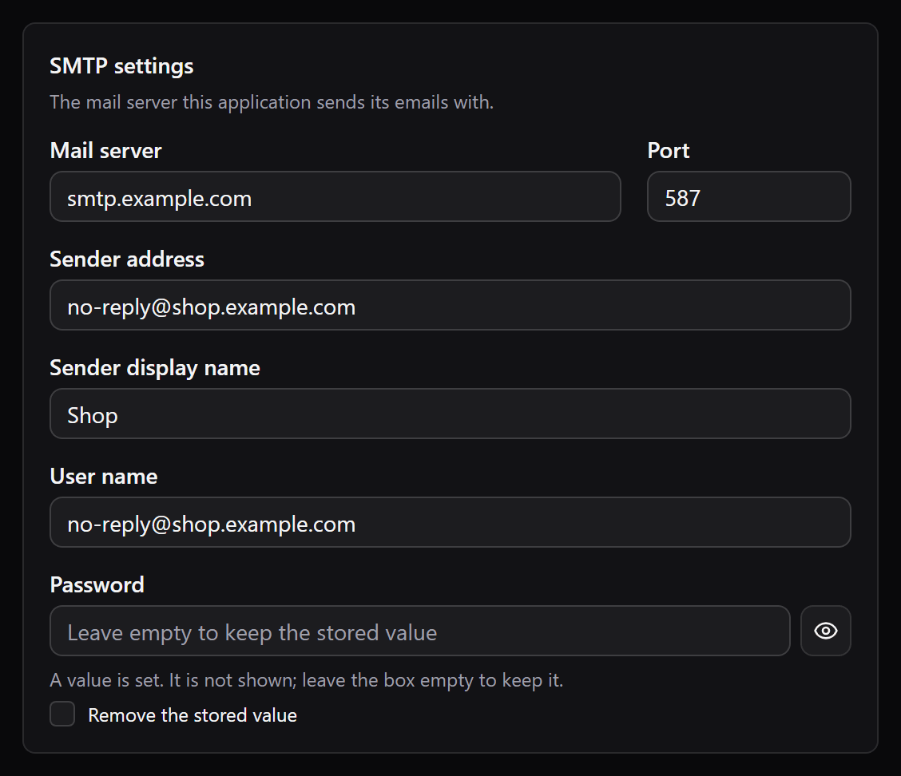
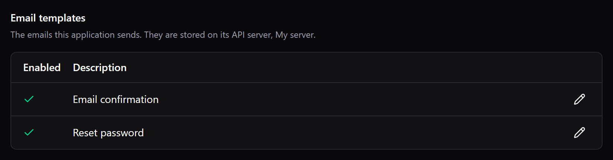
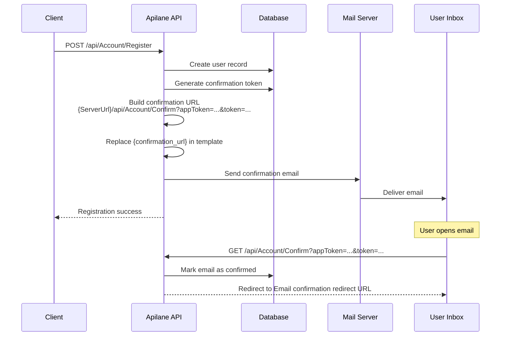
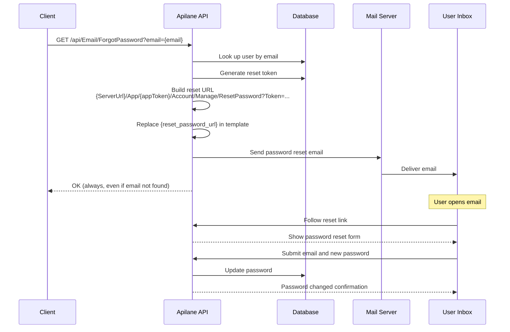
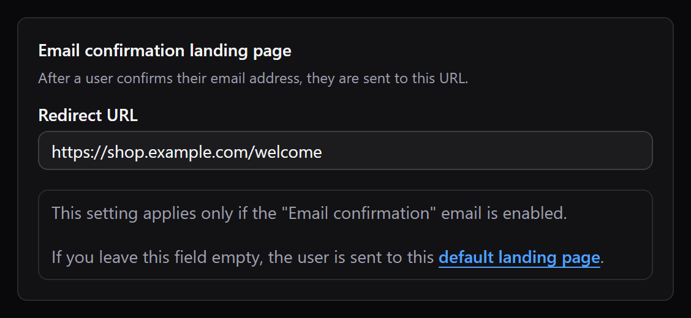

# Email templates

Apilane supports sending emails to users for account-related events such as registration confirmation and password recovery. Each application can be configured with its own SMTP settings and customizable email templates.

---

## SMTP configuration

Before emails can be sent, you must configure the SMTP settings for your application. Open the **Email** tab of your application in the Portal. **Save settings** saves the SMTP settings and the confirmation landing page together.

| Setting | Description |
|---|---|
| **Mail server** | SMTP server hostname (e.g., `smtp.gmail.com`) |
| **Port** | SMTP port of a server that accepts STARTTLS, typically `587`. Port `465` (implicit SSL) is not supported |
| **Sender address** | The "From" email address shown to recipients |
| **Sender display name** | The display name shown alongside the sender address |
| **User name** | SMTP authentication username |
| **Password** | SMTP authentication password. Once saved it is never shown again; an empty box keeps the stored value |



!!!warning "Required for email features"
    All SMTP fields must be configured for email functionality to work. If one is missing, the `Email/RequestConfirmation` and `Email/ForgotPassword` endpoints fail with an error, and so does `Account/Register` when the Email confirmation template is enabled. In that case the user has already been created by then, so register only after the SMTP settings are complete.

Mail is always sent over TLS. A send that fails is written to the API server's log and is not reported to the caller, so test with a real address.

---

## Available templates

Apilane provides two built-in email templates. Both are **switched off** in a new application: turn on **Enabled** in the editor of a template once the SMTP settings are filled in. A template that is off is never sent. Without the confirmation email, a user can sign in only while **Allow users with an unconfirmed email to sign in** is on (**Security** tab). Both the subject and body can be fully customized; the body is HTML (**Body (HTML)** in the editor). The templates are listed under **Email templates** on the same tab; editing one shows a live preview of its body. The **Help** button in the header of the tab explains the settings and the templates.

### Email confirmation

Sent to the user after registration. Typically contains a welcome message and a link to confirm the user's email address.

- **Event code**: `UserRegisterConfirmation`
- **Default subject**: `Welcome!`
- **Default body**: `Thank you for creating an account.<br/>Please click on this <a href="{confirmation_url}">link</a> to confirm your email address`

### Reset password

Sent to the user when they request a password reset via the `ForgotPassword` API endpoint or the ready-made page (see [Password reset flow](#password-reset-flow)).

- **Event code**: `UserForgotPassword`
- **Default subject**: `Reset Password`
- **Default body**: `Please click on this <a href="{reset_password_url}">link</a> to reset your password`



---

## Template placeholders

Customize your email templates using placeholders. Apilane replaces these with actual values when sending the email.

### User placeholders

These placeholders are available in **all** email templates:

| Placeholder | Description |
|---|---|
| `{Users.ID}` | The user's ID |
| `{Users.Username}` | The user's username |
| `{Users.Email}` | The user's email address |

### Event-specific placeholders

Each email event has its own special placeholder:

| Event | Placeholder | Description |
|---|---|---|
| Email confirmation | `{confirmation_url}` | The URL the user must follow to confirm their email address |
| Reset password | `{reset_password_url}` | The URL the user must follow to reset their password |

### Example template

```html
Hello {Users.Username},

Thank you for joining our platform!

Please click on this <a href="{confirmation_url}">link</a> to confirm 
your email address.

Best regards,
The Team
```

---

## Confirmation flow

When a user registers and email confirmation is enabled:


```mermaid
sequenceDiagram
    participant Client
    participant API as Apilane API
    participant DB as Database
    participant SMTP as Mail Server
    participant User as User Inbox

    Client->>API: POST /api/Account/Register
    API->>DB: Create user record
    API->>DB: Generate confirmation token
    API->>API: Build confirmation URL<br/>{ServerUrl}/api/Account/Confirm?appToken=...&token=...
    API->>API: Replace {confirmation_url} in template
    API->>SMTP: Send confirmation email
    SMTP->>User: Deliver email
    API-->>Client: Registration success
    Note over User: User opens email
    User->>API: GET /api/Account/Confirm?appToken=...&token=...
    API->>DB: Mark email as confirmed
    API-->>User: Redirect to Email confirmation redirect URL
```

1. User registers via `POST /api/Account/Register`
2. Apilane generates a unique confirmation token
3. The confirmation URL is built as: `{ServerUrl}/api/Account/Confirm?appToken={appToken}&token={confirmationToken}`
4. The `{confirmation_url}` placeholder is replaced with this URL in the email template
5. The email is sent to the user
6. When the user clicks the link within **1 hour**, their email is marked as confirmed
7. The browser redirects to the **Email confirmation redirect URL** (configurable in [Application settings](application.md#application-settings)). A link that is older than an hour, or unknown, leads to an error page of the API server instead; the user then asks for a new email via `Email/RequestConfirmation`

`{ServerUrl}` is the address of the API server as it is registered in the Portal, written in lower case.

!!!info "Re-sending confirmation"
    If a user loses their initial confirmation email, they can request a new one via the `Email/RequestConfirmation` API endpoint.

---

## Password reset flow

When a user requests a password reset:


```mermaid
sequenceDiagram
    participant Client
    participant API as Apilane API
    participant DB as Database
    participant SMTP as Mail Server
    participant User as User Inbox

    Client->>API: GET /api/Email/ForgotPassword?email={email}
    API->>DB: Look up user by email
    API->>DB: Generate reset token
    API->>API: Build reset URL<br/>{ServerUrl}/App/{appToken}/Account/Manage/ResetPassword?Token=...
    API->>API: Replace {reset_password_url} in template
    API->>SMTP: Send password reset email
    SMTP->>User: Deliver email
    API-->>Client: OK (always, even if email not found)
    Note over User: User opens email
    User->>API: Follow reset link
    API-->>User: Show password reset form
    User->>API: Submit email and new password
    API->>DB: Update password
    API-->>User: Password changed confirmation
```

1. Client calls `GET /api/Email/ForgotPassword?email={email}`
2. Apilane generates a unique reset token
3. The reset URL is built as: `{ServerUrl}/App/{appToken}/Account/Manage/ResetPassword?Token={resetToken}`
4. The `{reset_password_url}` placeholder is replaced in the email template
5. The email is sent to the user
6. The user follows the link and fills in a form with their **email address**, the new password (8 to 100 characters) and its confirmation. The password is changed only when the address is the one the link was sent to

There are two ways to start a reset: call the endpoint from your own screen, or send the user to the ready-made page `{ServerUrl}/App/{appToken}/Account/Manage/ForgotPassword` (shown on the **Security** tab, card **Forgot password**), where they type their address. Both send the Reset password email.

The link works for 24 hours, and stops working once a password has been set with it. After that the user has to request a new one.

!!!info "Security note"
    Both `RequestConfirmation` and `ForgotPassword` endpoints return success even if the email does not exist in the system. This prevents email enumeration attacks. They fail with an error when the application has no complete SMTP settings or the address is not a valid email address, and each allows **one call per 5 minutes for the same address** (`RATE_LIMIT_EXCEEDED`). Whether the mail was delivered is not reported.

---

## Confirmation landing page

After a user confirms their email by following the URL provided in the email, the browser eventually lands on a page. By default this is a page of the Portal (`{PortalUrl}/account/email-confirmed`, where `PortalUrl` is the API's setting). To use a URL of your choice, set **Redirect URL** under 'Email confirmation landing page' on the **Email** tab.


