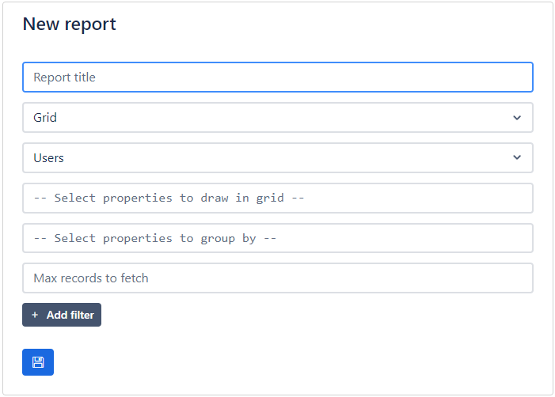
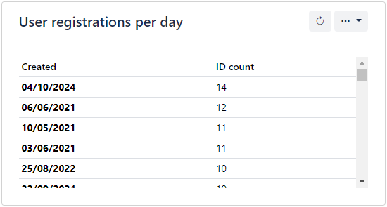
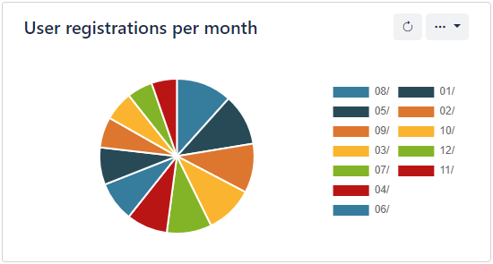
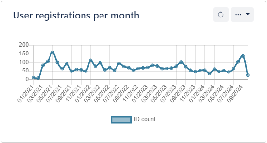

# Reports

Reports in a quick and easy way to get insights on your application data. You can visualize data from your entities in grids, pie charts or line charts. You can select which properties to visualize, group data by their properties and also apply filters.

Grid

Pie chart

Line chart

