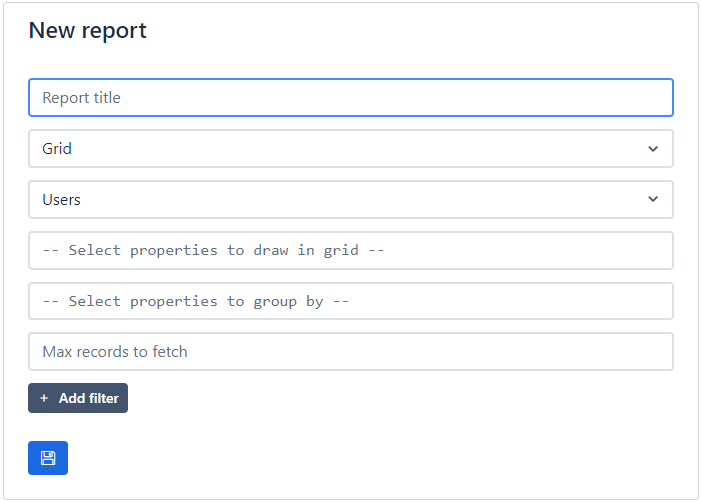
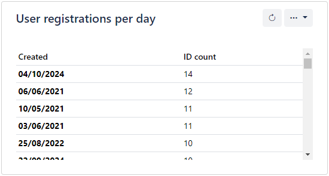
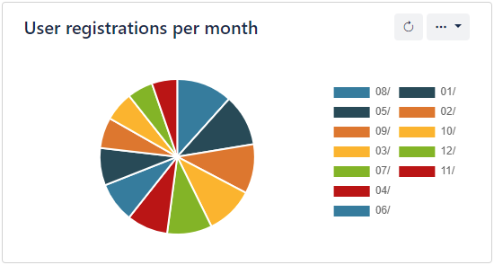
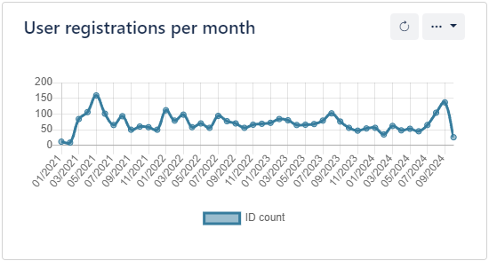

# Reports

Reports provide a quick and easy way to get insights on your application data. You can visualize data from your entities using grids, pie charts, or line charts. Select which properties to visualize, group data by their properties, and apply filters — all from the Portal.

---

## Creating a report

To create a report, navigate to the **Reports** section of your application in the Portal.

| Setting | Required | Description |
|---|---|---|
| **Title** | Yes | A descriptive name for the report |
| **Entity** | Yes | The entity to query data from |
| **Properties** | Yes | Which properties to include in the report (aggregation targets) |
| **Group By** | Yes | The property to group results by |
| **Report type** | Yes | How to visualize the data: Grid, Pie chart, or Line chart |
| **Max records** | Yes | Maximum number of rows to return (1–1,000) |
| **Filter** | No | Optional [filter](filtering_sorting.md) to narrow down the data |
| **Panel width** | No | Controls the display width of the report panel |
| **Order** | No | Controls the display order of reports |



---

## Report types

### Grid

Displays aggregated data in a tabular format. Best for detailed numeric comparisons across groups.



### Pie chart

Displays aggregated data as proportional slices. Best for showing the distribution or composition of a single metric across groups.



### Line chart

Displays aggregated data as a line graph. Best for showing trends over time or ordered categories.



---

## How reports work

Reports are powered by the [Stats/Aggregate](../api_reference.md#aggregate) API endpoint under the hood. When you view a report in the Portal, it makes a request like:

```
GET /Stats/Aggregate?Entity={entity}&Properties={properties}&Filter={filter}&Sort=Desc&GroupBy={groupBy}&PageIndex=1&PageSize={maxRecords}
```

This means reports have the same capabilities and respect the same security rules as direct API calls to the Stats endpoints.

---

## Tips

- **Use filters** to focus reports on specific subsets of data (e.g., records created in the last 30 days)
- **Group by date properties** (like `Created`) for time-series analysis using line charts
- **Combine with distinct values** — use the [Stats/Distinct](../api_reference.md#distinct) endpoint to discover available grouping values
- **Multiple reports** can be created for the same entity with different configurations to provide different views of the data
