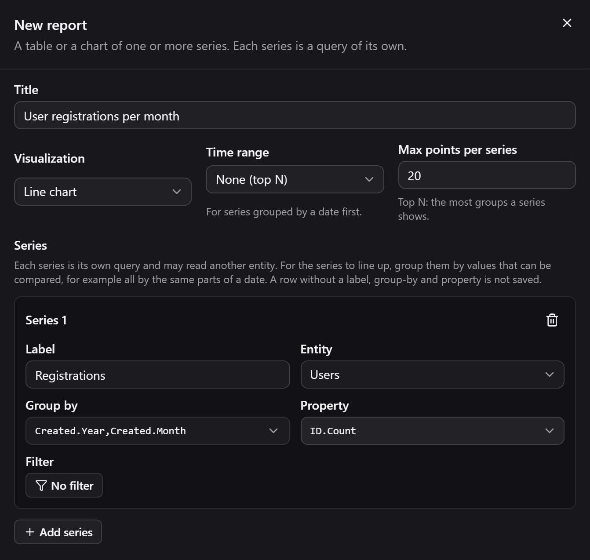
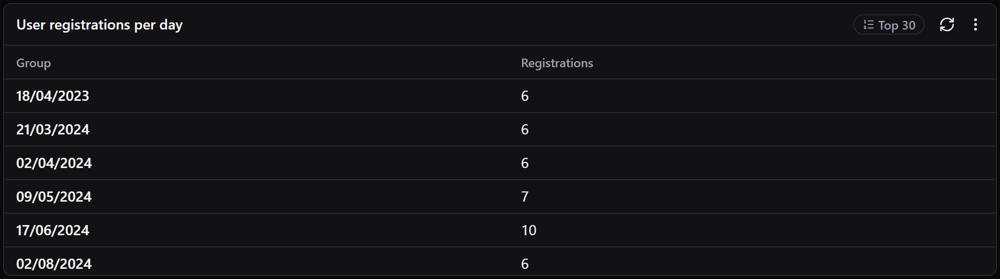
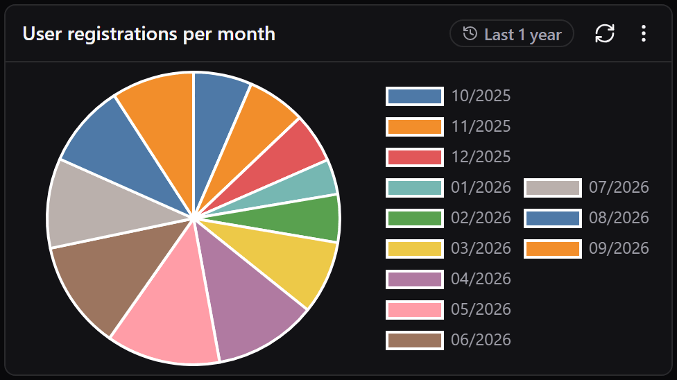
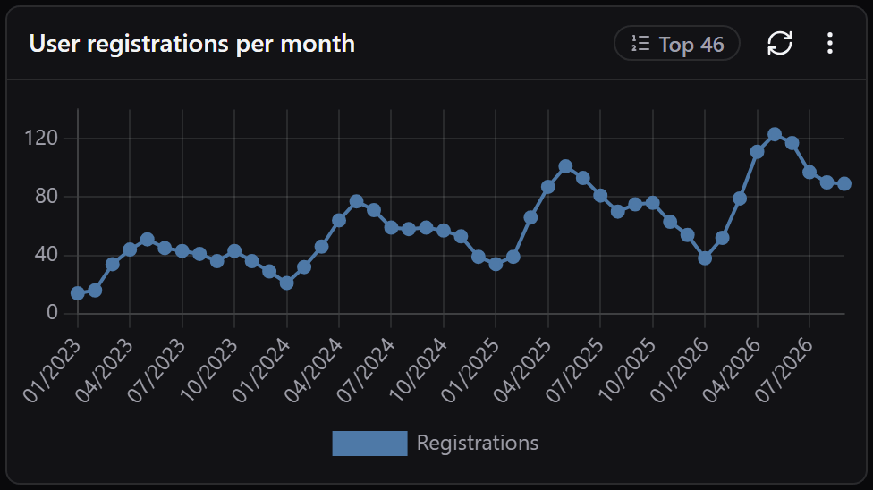

# Reports

Reports provide a quick and easy way to get insights on your application data. A report is a panel on the application's dashboard that shows one or more series of aggregated data as a grid or a chart. Select what to aggregate, group the data by its properties, and apply filters — all from the Portal.

---

## Creating a report

To create a report, open the **Reports** tab of your application in the Portal and click **New report**. The **Help** button in the header of the tab explains the reports.

| Setting | Required | Description |
|---|---|---|
| **Title** | Yes | A descriptive name for the report |
| **Visualization** | Yes | How to visualize the data: Grid, Pie chart, Line chart, Bar chart, Radar chart or Stacked bar chart |
| **Time range** | No | The last hours, days, months or years to show (e.g. *Last 7 days*, or a custom number and unit). It applies to series that are grouped by a date first |
| **Max points per series** | Yes | Top N: the most groups a series shows (1–1,000), the groups with the largest values. It applies to a series with a time range too: with the default of 20, a daily series over *Last 30 days* shows only its 20 busiest days. Raise it to at least the number of groups in the range |

A report has one or more **series**. Each series has:

| Setting | Required | Description |
|---|---|---|
| **Label** | Yes | The name of the series in the legend |
| **Entity** | Yes | The entity to query data from |
| **Group by** | Yes | The property or properties to group results by |
| **Property** | Yes | The value to show: a property with its aggregate (e.g. `ID.Count`) |
| **Filter** | No | Optional [filter](filtering_sorting.md) to narrow down the data |

What a series can show depends on the entity and the visualization; the editor offers only what fits:

- **Property:** `ID.Count` counts the records. A number property can be `Max`, `Min`, `Sum` or `Avg`. A text or date property can be `Max` or `Min`, in a Grid only.
- **Group by:** one or more properties, each listed once. A date is grouped by its parts: `Created.Year`, `Created.Month`, `Created.Day`, `Created.Hour`, `Created.Minute` and `Created.Second`. A Line chart groups by numbers and dates only; the other visualizations also by text and yes/no properties.
- A Pie chart draws the first series only.
- **Time range:** a number from 1 to 1000 followed by hours, days, months or years.

A new application already has one report, **User registrations per day**: a line chart of the entity `Users`, grouped by `Created.Year`, `Created.Month` and `Created.Day`, counting `ID.Count`. Edit it to see how a series is put together.

On the dashboard, drag a panel by its title to move it and by its edges to resize it; the layout is saved automatically. On a narrow screen the panels are shown in one column. The menu of a panel has **Edit**, **View API endpoint** and **Delete**.



---

## Report types

The three types below are shown as examples. Bar, Radar and Stacked bar charts take the same settings.

### Grid

Displays aggregated data in a tabular format. Best for detailed numeric comparisons across groups.



### Pie chart

Displays aggregated data as proportional slices. Best for showing the distribution or composition of a single metric across groups.



### Line chart

Displays aggregated data as a line graph. Best for showing trends over time or ordered categories.



---

## How reports work

Reports are powered by the [Stats/Aggregate](../api_reference.md#aggregate) API endpoint under the hood. When you view a report in the Portal, your browser makes one request per series to the API, like:

```
GET /api/Stats/Aggregate?Entity={entity}&Properties={property}&Filter={filter}&GroupBy={groupBy}&PageIndex=1&PageSize={maxPoints}
```

**View API endpoint** in the menu of a panel shows the exact address of each series.

This means a report can be reproduced by any client with the same call. In the Portal the calls are made as the person who manages the application, with full access: the [security rules](security.md) and rate limits do not apply there. A client of your own that calls the address shown by **View API endpoint** is a normal caller: it needs a `get` rule on the entity, and it gets only the properties and records that rule gives.

---

## Tips

- **Use filters** to focus reports on specific subsets of data (e.g., records created in the last 30 days)
- **Group by date properties** (like `Created`) for time-series analysis using line charts
- **Combine with distinct values** — use the [Stats/Distinct](../api_reference.md#distinct) endpoint to discover available grouping values
- **Multiple reports** can be created for the same entity with different configurations to provide different views of the data
