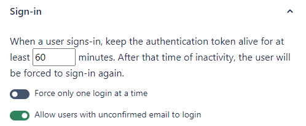
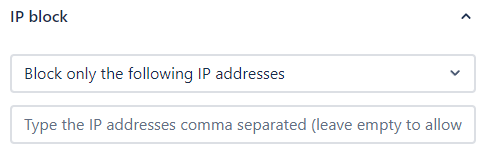
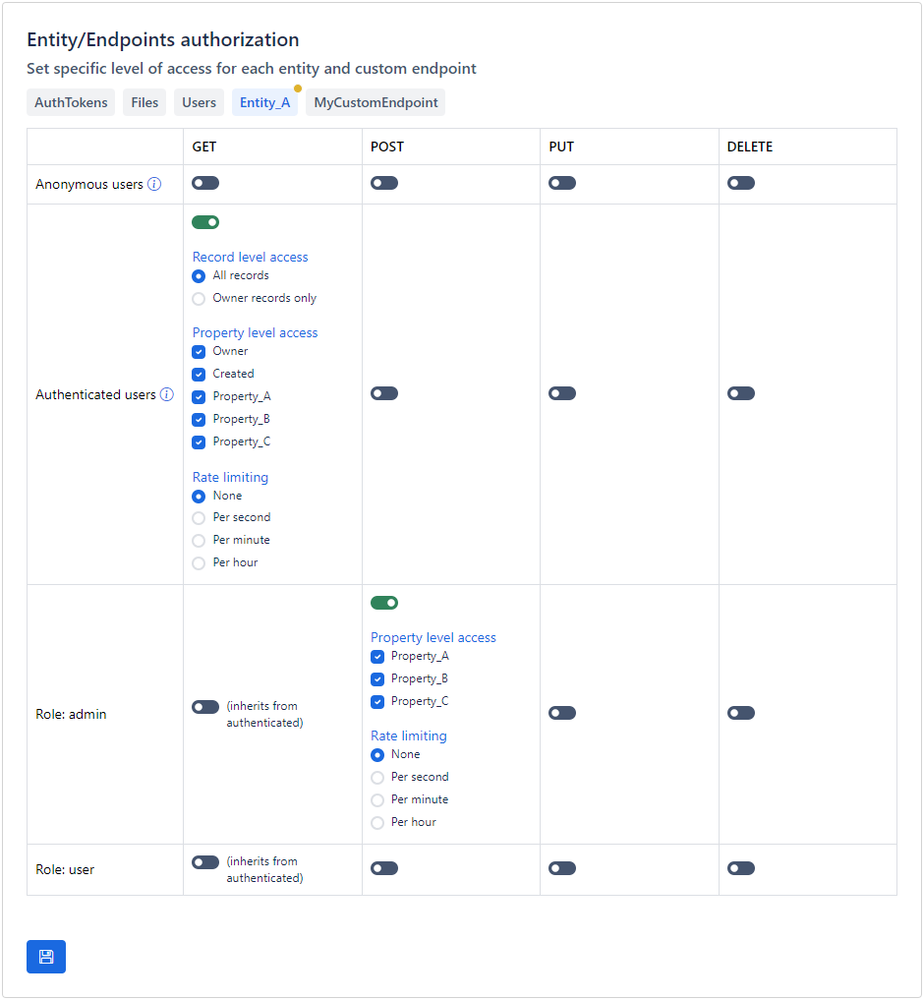
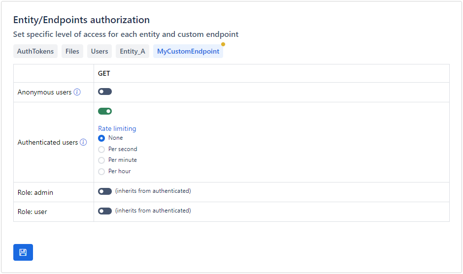
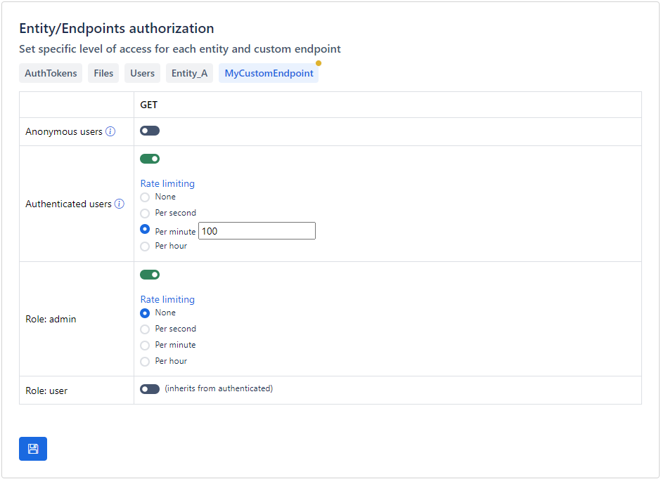

# Security

Apilane provides all the tools required for granular access control to the application on entity and property level.

## Sign in

#### Force only one login at a time
If this option is enabled, each new user login forces logout from any previous logged in sessions. This setting essentialy deletes/deprecates any previous authentication tokens which will prevent further access using these tokens.

#### Allow users with unconfirmed email to login
If this option is enabled, all users can login regardless if the email is confirmed or not. Disabling this requires that uses have confirmed their email before being able to login and retrieve an authentication token.

## Register

#### Allow new users to register
Allow or prevent new users from registering. This option may be useful for internal applications that you would like to protect from unintended registrations.

## IP allow/block

#### Block only the following IP addresses
Use this setting to block specific IP addresses from accessing your application. This configuration may be usefull if you wish to isolate applications, e.g. prevent access to a production application from a development/staging server.
#### Allow only the following IP addresses
Use this setting to allow only specific IP addresses access your application. This configuration may be usefull if you wish to isolate applications, e.g. allow access to a production application only from a production server.

!!!warning "Warning"
    These settings are not a replacement for network security tools. You can use these settings as an additional security measure but not as the main application security tool.

## Entities/Properties

Apilane provides tools to enable granular access control to the application on entity and property level.

!!!info "Note"
    Apilane implements a robust role-based access control (RBAC) system that allows for granular access to endpoints based on user roles. This system is designed to accommodate overlapping roles to ensure flexibility and precision in permission management.

    For instance, a user assigned the 'admin' role inherits all the permissions of an 'authorized user,' granting them broader access to various functionalities. However, the 'authorized user' role is governed by its own distinct access rules, tailored to specific operational requirements.

    This means that while both roles can access certain endpoints, the 'admin' user may have additional capabilities such as modifying data, whereas the 'authorized user' may be limited to read-only access.

<figure markdown="span">
  
  <figcaption>On this sample setup, all authenticated users are allowed to read all properties of entity `Entity_A` but only users in role `admin` are allowed to create new records.</figcaption>
</figure>

## Custom endpoints

Apilane provides tools to enable granular access control to the application custom endpoints.

<figure markdown="span">
  
  <figcaption>On this sample setup, all authenticated users are allowed to call the endpoint `MyCustomEndpoint`.</figcaption>
</figure>

## Rate limiting

If an application is accessible on the internet, you must also be prepared to deal with malicious users. For instance, if you permit unauthorized users to create records for an entity, it becomes easy for anyone to automate the process with a bot, potentially overwhelming your entity with millions of records.

One way to minimize the impact of a malicious attack, is rate limiting. Rate limiting is a crucial security measure that helps protect your application by controlling the number of requests a user can make in a given timeframe, thus preventing abuse, ensuring fair usage, and maintaining optimal performance; however, it's essential to tailor rate limiting strategies to the specific domain and context of your application to **balance security with user experience**.

!!!info "Note"
    Apilane features an advanced rate limiting management system designed to ensure fair usage and protect against abuse. When multiple rate limiting rules are applicable to a particular user or endpoint, the system evaluates all relevant rules and ultimately applies the **most permissive rule**, allowing for the highest allowable request rate.

    This approach facilitates flexible rule definitions tailored to different user roles, scenarios, or endpoints while ensuring that users can benefit from the most lenient usage conditions permitted by the applicable rules. For instance, if a user qualifies for several rate limiting rules, one allowing a higher request rate and another enforcing a stricter limit, the application will enforce the higher rate to ensure optimal access.

<figure markdown="span">
  
  <figcaption>On this sample setup, all authenticated users are allowed to call the endpoint `MyCustomEndpoint` at most 100 times per minute while users in role `admin` are allowed to call the endpoint unlimited times per second.</figcaption>
</figure>

!!!info Note
    Apilane employs **Sliding Window Rate Limiting** to manage and control the rate of requests from users effectively. This method allows for a more granular approach to tracking request counts over time compared to traditional fixed window strategies
