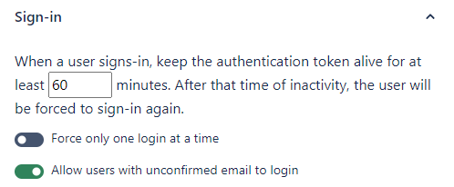
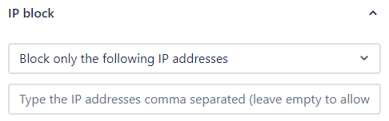
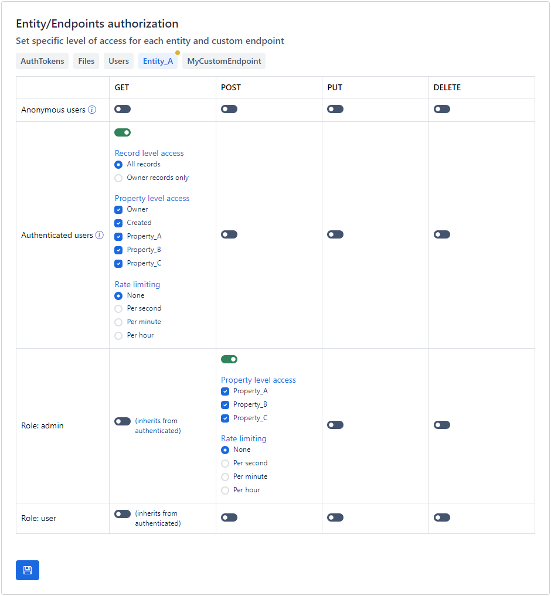
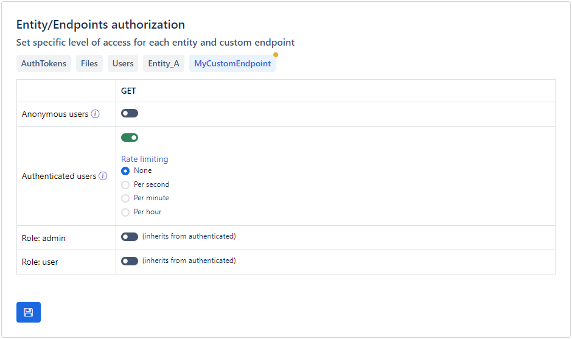
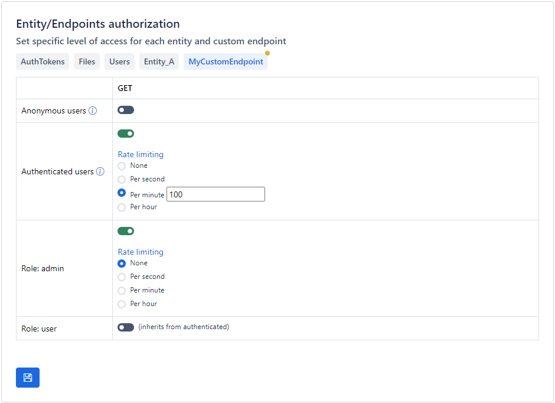

# Security

Apilane provides all the tools required for granular access control to the application on entity and property level.

---

## Sign in

#### Force only one login at a time
If this option is enabled, each new user login forces logout from any previous logged-in sessions. This setting essentially deletes/deprecates any previous authentication tokens, which will prevent further access using those tokens.

#### Allow users with unconfirmed email to login
If this option is enabled, all users can login regardless of whether their email is confirmed or not. Disabling this requires that users have confirmed their email before being able to login and retrieve an authentication token.

#### Auth token expiration
Each application defines how long authentication tokens remain valid (in minutes). After expiration, the user must log in again or renew the token via the `RenewAuthToken` endpoint.

---

## Register

#### Allow new users to register
Allow or prevent new users from registering. This option may be useful for internal applications that you would like to protect from unintended registrations.

---

## IP allow/block

Two modes are available for IP-based access control:

#### Block only the following IP addresses
Use this setting to block specific IP addresses from accessing your application. This configuration may be useful if you wish to isolate applications, e.g. prevent access to a production application from a development/staging server.

#### Allow only the following IP addresses
Use this setting to allow only specific IP addresses to access your application. This configuration may be useful if you wish to isolate applications, e.g. allow access to a production application only from a production server.

!!!warning "Warning"
    These settings are not a replacement for network security tools. You can use these settings as an additional security measure but not as the main application security tool.

---

## Roles

Apilane uses a role-based access control (RBAC) system with two built-in roles:

| Role | Description | Scope |
|---|---|---|
| **ANONYMOUS** | Any request without an authentication token | Public-facing endpoints |
| **AUTHENTICATED** | Any request with a valid authentication token | Logged-in user operations |

You can create **custom roles** (e.g., `admin`, `manager`, `editor`) and assign them to application users. A user can have multiple roles (comma-separated), and permissions are evaluated across all applicable roles.

!!!info "How role evaluation works"
    When evaluating security rules, Apilane takes the user's custom roles (from their `Roles` property) and automatically adds `ANONYMOUS` and `AUTHENTICATED`. All matching security rules are then applied. This means an authenticated user with a custom `admin` role will match rules targeting `ANONYMOUS`, `AUTHENTICATED`, and `admin`.

---

## Entities/Properties

Apilane provides tools to enable granular access control to the application on entity and property level.

### Security types

Security rules apply to three categories:

| Type | Target | Description |
|---|---|---|
| **Entity** | Data entities | Control CRUD access to entities and their properties |
| **Custom Endpoint** | Custom endpoints | Control who can execute custom SQL endpoints |
| **Schema** | Entity schema | Control who can view entity schema definitions |

### Actions

For each entity, you can configure permissions per role for these actions:

| Action | HTTP Method | Description |
|---|---|---|
| **get** | `GET` | Read records from the entity |
| **post** | `POST` | Create new records |
| **put** | `PUT` | Update existing records |
| **delete** | `DELETE` | Delete records |

### Record ownership

For `get`, `put`, and `delete` actions, you can further restrict access based on record ownership:

- **All records** — The role can access any record in the entity
- **Own records only** — The role can only access records where the `Owner` property matches the current user's ID

### Property-level access

For each role and action, you can specify which properties are accessible. This allows you to:

- Hide sensitive properties from certain roles
- Allow a role to read all properties but only write to specific ones
- Create different views of the same entity for different user groups

!!!info "Note"
    Apilane implements a robust role-based access control (RBAC) system that allows for granular access to endpoints based on user roles. This system is designed to accommodate overlapping roles to ensure flexibility and precision in permission management.

    For instance, a user assigned a custom `admin` role will also match rules for `AUTHENTICATED`, granting them broader access to various functionalities. However, the `AUTHENTICATED` role is governed by its own distinct access rules, tailored to specific operational requirements.

    This means that while both roles can access certain endpoints, the custom `admin` user may have additional capabilities such as modifying data, whereas the `AUTHENTICATED` role may be limited to read-only access.

<figure markdown="span">
  
  <figcaption>On this sample setup, all authenticated users are allowed to read all properties of entity `Entity_A` but only users in role `admin` are allowed to create new records.</figcaption>
</figure>

---

## Custom endpoints

Apilane provides tools to enable granular access control to the application custom endpoints.

<figure markdown="span">
  
  <figcaption>On this sample setup, all authenticated users are allowed to call the endpoint `MyCustomEndpoint`.</figcaption>
</figure>

---

## Rate limiting

If an application is accessible on the internet, you must also be prepared to deal with malicious users. For instance, if you permit unauthorized users to create records for an entity, it becomes easy for anyone to automate the process with a bot, potentially overwhelming your entity with millions of records.

One way to minimize the impact of a malicious attack is rate limiting. Rate limiting is a crucial security measure that helps protect your application by controlling the number of requests a user can make in a given timeframe, thus preventing abuse, ensuring fair usage, and maintaining optimal performance.

### How it works

Apilane employs **Sliding Window Rate Limiting** to manage and control the rate of requests from users effectively. This method allows for a more granular approach to tracking request counts over time compared to traditional fixed window strategies.

### Configuration options

For each security rule, you can configure a rate limit with two parameters:

| Parameter | Description |
|---|---|
| **Max requests** | Maximum number of requests allowed in the time window |
| **Time window** | The rate limiting period |

Available time windows:

| Time Window | Description |
|---|---|
| **Per second** | Maximum requests per second |
| **Per minute** | Maximum requests per minute |
| **Per hour** | Maximum requests per hour |

### Multiple rules

When multiple rate limiting rules are applicable to a particular user or endpoint, the system evaluates all relevant rules and ultimately applies the **most permissive rule**, allowing for the highest allowable request rate.

!!!info "Note"
    This approach facilitates flexible rule definitions tailored to different user roles, scenarios, or endpoints while ensuring that users can benefit from the most lenient usage conditions permitted by the applicable rules. For instance, if a user qualifies for several rate limiting rules, one allowing a higher request rate and another enforcing a stricter limit, the application will enforce the higher rate to ensure optimal access.

<figure markdown="span">
  
  <figcaption>On this sample setup, all authenticated users are allowed to call the endpoint `MyCustomEndpoint` at most 100 times per minute while users in role `admin` are allowed to call the endpoint unlimited times per second.</figcaption>
</figure>

### Best practices

- **Always rate limit public endpoints** — Entities accessible by `Anonymous` users should always have rate limits configured
- **Balance security with usability** — Overly strict rate limits may frustrate legitimate users. Tailor limits to your application's specific usage patterns
- **Use different limits for different roles** — Administrators and internal services typically need higher limits than end users
- **Monitor rate limit hits** — If legitimate users are frequently hitting rate limits, consider adjusting the thresholds
