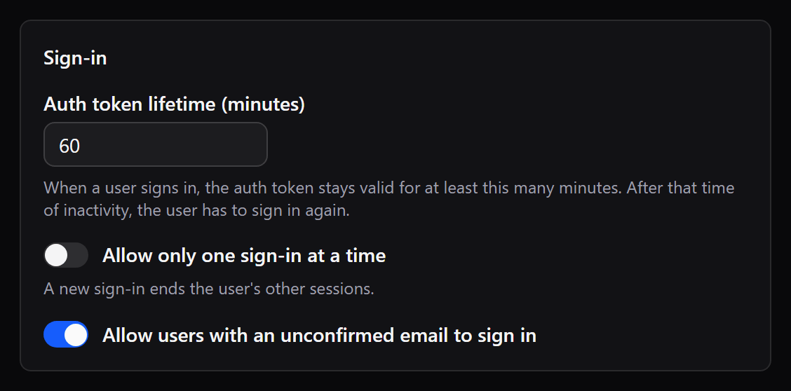
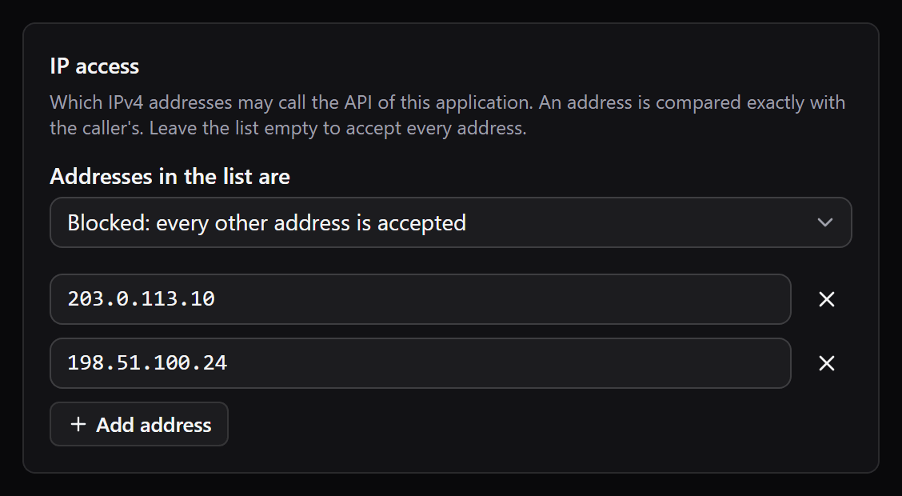
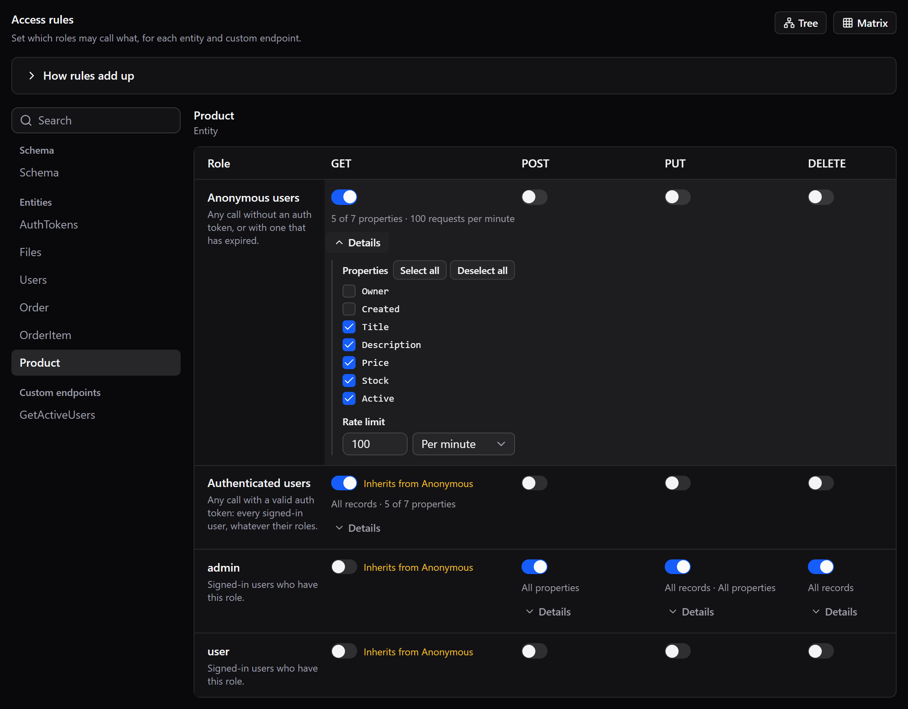
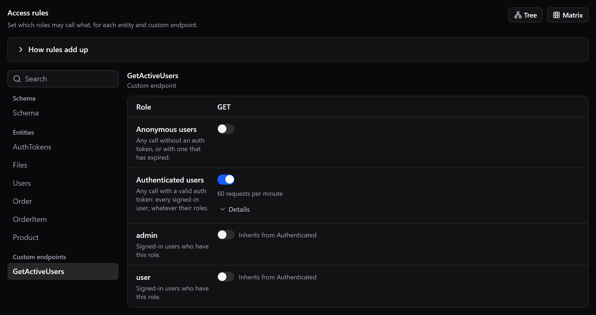
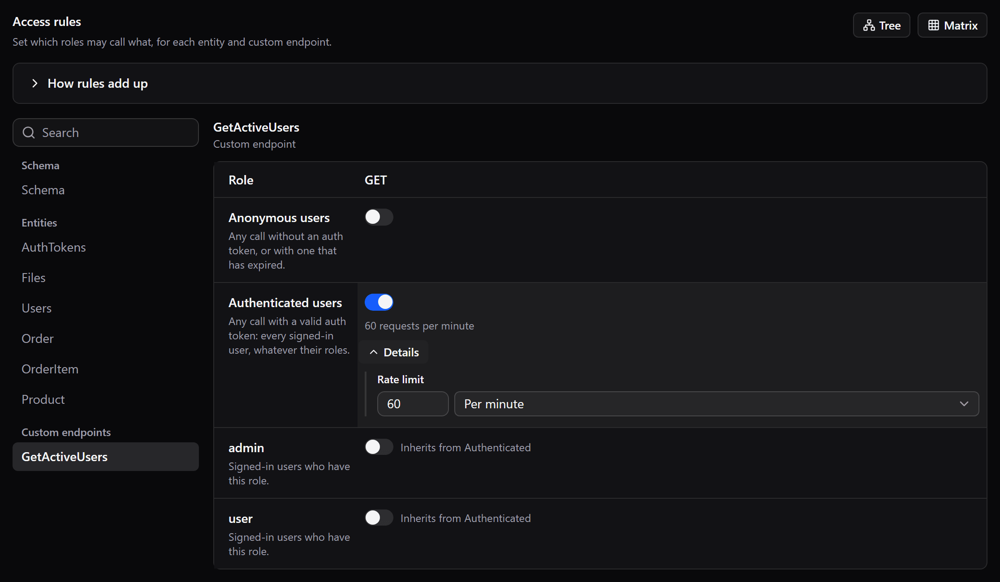

# Security

Apilane provides all the tools required for granular access control to the application on entity and property level.

---

The settings on this page are on the **Security** tab of the application in the Portal. The access settings (the cards Sign-in, Register, Files and IP access) are saved together with **Save settings**; the rules per entity and custom endpoint are edited further down the same screen and saved on their own. The **Help** button in the header of the screen, and the one of the access rules, explain them on the spot.

A new application starts with a token lifetime of 60 minutes, **Allow users with an unconfirmed email to sign in** on, **Allow new users to register** on, **Allow only one sign-in at a time** off and a maximum file size of 100 KB.

---

## Sign in

#### Allow only one sign-in at a time
If this option is enabled, each new user login forces logout from any previous logged-in sessions. This setting essentially deletes/deprecates any previous authentication tokens, which will prevent further access using those tokens.

#### Allow users with an unconfirmed email to sign in
If this option is enabled, all users can login regardless of whether their email is confirmed or not. Disabling this requires that users have confirmed their email before being able to login and retrieve an authentication token.

#### Auth token lifetime (minutes)
Each application defines how long authentication tokens remain valid after the last authenticated request (in minutes). The token is extended by a call made after more than a tenth of the lifetime has passed since the last extension, so a token expires after about this time of **inactivity** (at least 90% of it). Once expired, the user must log in again or renew the token beforehand via the `RenewAuthToken` endpoint. A change to the roles of a user who is already signed in can take until their token is next extended, or until their next sign-in, to reach them.



#### Authenticating requests

Once logged in, a client authenticates each request in one of two ways:

**1. Bearer token (default).** Send the authentication token in the `Authorization: Bearer <token>` header. Simple, but the secret travels on every request — anyone able to observe it (logs, a TLS-terminating proxy, browser history) can reuse it until it expires.

**2. Signed requests (proof-of-possession).** The token is treated as a shared secret that is stored once at login and **never transmitted again**. Each request instead carries an HMAC signature proving the client holds the token. This is safer than bearer: a logged or intercepted request does not expose the token, and it can only be replayed for a short time.

Login (and the login response of the SDKs) returns the token's **id** (`AuthTokenID`) in addition to the token. The id is the public key identifier; the token is the signing secret. The client sends these headers:

| Header | Value |
|---|---|
| `x-auth-keyid` | the `AuthTokenID` (public, not secret) |
| `x-auth-timestamp` | current time in unix milliseconds |
| `x-auth-signature` | base64 HMAC-SHA256 of the canonical request string |

The signature is computed as `HMAC-SHA256(secret = token, message = canonical)` where the canonical string is the newline-joined list:

```
keyId
HTTP-METHOD (upper-case)
path + query (as sent)
timestamp
base64(SHA-256(request body))
```

The server resolves the secret from `x-auth-keyid`, recomputes the signature over the same canonical string, and compares it in constant time. A request whose timestamp is outside a small clock-skew window (fixed at ±2 minutes, not configurable) or whose signature does not match is treated like a request without a valid token: it is answered `UNAUTHORIZED` unless an ANONYMOUS rule allows it.

Because the secret is never sent, a logged or intercepted request cannot expose the token, and an intercepted request is only usable inside that short window. Requests are not numbered, so an intercepted request can be sent again until that window has passed. Both the .NET and JavaScript SDKs implement this via `.WithSigning(keyId, secret)` / `.withSigning(keyId, secret)` on any request. (File uploads cannot be signed and must use the bearer token.)

A link that cannot set headers (for example a file in an ``) may carry the token as the `authToken` query parameter instead. A URL is kept in logs, proxies and browser history, so use this only for such links and never for calls you make from code. The API server masks the value in its own log, but the access log of a reverse proxy in front of it keeps the whole address.

---

## Register

#### Allow new users to register
Allow or prevent new users from registering. This option may be useful for internal applications that you would like to protect from unintended registrations.


---

## Files

#### Maximum file size (KB)
The largest file a user can upload, from 1 KB to 25,600 KB (25 MB). Whether a user can upload at all, and whose files they can read, is an access rule on the `Files` entity (see [Files](files.md)).

---

## IP allow/block

Two modes are available for IP-based access control (card **IP access**, choice 'Addresses in the list are'). Addresses are plain dotted IPv4, one per box, compared exactly with the caller's address. An empty list accepts every address. The caller's address is the first entry of the `X-Forwarded-For` header when the request carries one (a reverse proxy sets it), otherwise the address of the connection. The list does not apply to people who manage the application in the Portal.

#### Blocked: every other address is accepted
Use this setting to block specific IP addresses from accessing your application. This configuration may be useful if you wish to isolate applications, e.g. prevent access to a production application from a development/staging server.

#### Allowed: every other address is blocked
Use this setting to allow only specific IP addresses to access your application. This configuration may be useful if you wish to isolate applications, e.g. allow access to a production application only from a production server.

!!!warning "Warning"
    Anyone who can reach the API server directly can send their own `X-Forwarded-For` header, so the list is only reliable when a proxy in front of the API server sets or overwrites that header and is the only way in. These settings are not a replacement for network security tools. You can use these settings as an additional security measure but not as the main application security tool.



---

## Forgot password

The **Forgot password** card shows two addresses that start a password reset: a ready-made page for your users (`{ServerUrl}/App/{appToken}/Account/Manage/ForgotPassword`) and the `Email/ForgotPassword` endpoint. Both send the Reset password [email](email_templates.md) and need the SMTP settings, and both share one limit of one email per address every 5 minutes. The card has nothing to save.

---

## Roles

Apilane uses a role-based access control (RBAC) system with two built-in roles:

| Role | Description | Scope |
|---|---|---|
| **ANONYMOUS** | Any request without a valid authentication token: none, an expired or unknown one, or a signed request whose signature does not verify. Its rules apply to every caller | Public-facing endpoints |
| **AUTHENTICATED** | Any request with a valid authentication token | Logged-in user operations |

You can create **custom roles** (e.g., `admin`, `manager`, `editor`) and assign them to application users. A role is a name in the `Roles` property of a user: lower-case letters `a-z` only (no digits, spaces, capitals or `_`), several roles separated by commas (`admin,editor`). There is no list of roles to maintain: a role exists once a user has it or a rule names it. Permissions are evaluated across all applicable roles.

A user cannot choose their own roles: `Account/Register` and `Account/Update` do not set `Roles`. Set them by editing the user on the **Data** tab of the Portal, or give a trusted role a `put` rule on `Users` that includes the `Roles` property. As `Users` has no owner, such a role can change the roles of any user.

!!!info "How role evaluation works"
    When evaluating security rules, Apilane takes the user's custom roles (from their `Roles` property) and automatically adds `ANONYMOUS` and `AUTHENTICATED`. All matching security rules are then applied. This means an authenticated user with a custom `admin` role will match rules targeting `ANONYMOUS`, `AUTHENTICATED`, and `admin`.

---

## Entities/Properties

Apilane provides tools to enable granular access control to the application on entity and property level.

### Security types

Security rules apply to three categories:

| Type | Target | Description |
|---|---|---|
| **Entity** | Data entities | Control CRUD access to entities and their properties |
| **Custom Endpoint** | Custom endpoints | Control who can execute custom SQL endpoints |
| **Schema** | Entity schema | Control who can view entity schema definitions |

### Actions

For each entity, you can configure permissions per role for these actions:

| Action | HTTP Method | Description |
|---|---|---|
| **get** | `GET` | Read records from the entity |
| **post** | `POST` | Create new records |
| **put** | `PUT` | Update existing records |
| **delete** | `DELETE` | Delete records |

### Record ownership

For `get`, `put`, and `delete` actions, you can further restrict access based on record ownership:

- **All records** — The role can access any record in the entity
- **Owned records only** — The role can only access records where the `Owner` property matches the current user's ID

### Property-level access

For each role and action, you can specify which properties are accessible. This allows you to:

- Hide sensitive properties from certain roles
- Allow a role to read all properties but only write to specific ones
- Create different views of the same entity for different user groups

A rule with no property selected is not full access: a `get` then returns only the record ID, and a `post` or `put` is refused.

The **Tree** and **Matrix** buttons above the rules show the saved rules read-only, as the API enforces them: per item, role and action, with inherited access included.

!!!info "Note"
    Apilane implements a robust role-based access control (RBAC) system that allows for granular access to endpoints based on user roles. This system is designed to accommodate overlapping roles to ensure flexibility and precision in permission management.

    For instance, a user assigned a custom `admin` role will also match rules for `AUTHENTICATED`, granting them broader access to various functionalities. However, the `AUTHENTICATED` role is governed by its own distinct access rules, tailored to specific operational requirements.

    This means that while both roles can access certain endpoints, the custom `admin` user may have additional capabilities such as modifying data, whereas the `AUTHENTICATED` role may be limited to read-only access.

<figure markdown="span">
  
  <figcaption markdown>On this sample setup, everybody, signed in or not, can read 5 of the 7 properties of the entity `Product`, at most 100 times per minute, and only users in role `admin` can create, change and delete records.</figcaption>
</figure>

### How several rules combine

A call gets what ANONYMOUS, AUTHENTICATED (for a signed-in user) and each of the user's roles allow, **together**. Another rule never takes an action away; only **Owned records only** narrows what the others give:

- **Actions:** if any applicable rule allows the action, the caller may do it. Without a rule there is no access.
- **Properties:** the properties of all applicable rules are added together. The `ID` is always included.
- **Records:** if any applicable rule is limited to owned records, the caller gets only their own records, even when another rule gives all records. For a role to see every record, none of the rules that apply to its users for that action (ANONYMOUS, AUTHENTICATED or another role) may be limited to owned records.
- **Rate limit:** see [Multiple rules](#multiple-rules).

**Owned records only** has no effect on `post`, on the entity `Users` (it has no owner), or for a caller without a valid token: an anonymous caller has no owner, so an ANONYMOUS rule marked Owned gives them every record. Leave it off for ANONYMOUS.

---

## Custom endpoints

Apilane provides tools to enable granular access control to the application custom endpoints.

<figure markdown="span">
  
  <figcaption markdown>On this sample setup, all authenticated users are allowed to call the endpoint `GetActiveUsers`, at most 60 times per minute.</figcaption>
</figure>

Until a custom endpoint has a rule for the caller, every call to it is refused (`UNAUTHORIZED`).

---

## Rate limiting

If an application is accessible on the internet, you must also be prepared to deal with malicious users. For instance, if you permit unauthorized users to create records for an entity, it becomes easy for anyone to automate the process with a bot, potentially overwhelming your entity with millions of records.

One way to minimize the impact of a malicious attack is rate limiting. Rate limiting is a crucial security measure that helps protect your application by controlling the number of requests a user can make in a given timeframe, thus preventing abuse, ensuring fair usage, and maintaining optimal performance.

### How it works

Apilane employs **Sliding Window Rate Limiting** to manage and control the rate of requests from users effectively. This method allows for a more granular approach to tracking request counts over time compared to traditional fixed window strategies.

!!!warning "Multi-instance deployments"
    Rate limiting is enforced **per API server instance**, not across the entire cluster. In a multi-instance deployment (e.g., Kubernetes with multiple replicas), each API server maintains its own independent rate limit counters in memory.
    
    **Example:** If you configure a rate limit of 100 requests per minute and deploy 3 API instances behind a load balancer, the effective rate limit is approximately **300 requests per minute** (100 per instance), depending on how traffic is distributed across instances.
    
    For cluster-wide rate limiting, consider using an external rate limiting solution (e.g., API Gateway, reverse proxy with rate limiting, or distributed rate limiter with shared state in Redis).

### What counts as a request

A rate limit belongs to a security rule, so requests are counted per entity (or custom endpoint), per action and per user. All anonymous callers of an application share one count.

Every request that the rule lets in counts, whichever endpoint it arrives through:

- **Reads** — `Data/Get`, `Data/GetByID`, `Data/GetHistoryByID`, `Stats/Aggregate` and `Stats/Distinct` all use the `get` allowance of the entity.
- **Files** — `Files/Get`, `Files/GetByID` and `Files/Download` use the `get` allowance of `Files`; `Files/Post` and `Files/Delete` use its `post` and `delete` allowances.
- **Transactions** — each operation inside `Data/Transaction` or `Data/TransactionOperations` counts as one request against the rule of its own entity or custom endpoint. If one operation is refused, the whole transaction is refused and nothing is written, but the operations before it still count. A transaction with more operations on one rule than the rule allows in its time window can therefore never succeed: keep transactions within the limit, or raise the limit.
- **Schema** — `Data/Schema` uses the allowance of the schema rule.

A single request or operation that carries several records (a post with an array of records) counts once. An entity and a custom endpoint with the same name are counted separately.

People who manage the application (its owner, its collaborators and the administrators of the instance) working in the Portal are never rate limited, and the security rules and the IP list do not apply to them.

### Configuration options

For each security rule, you can configure a rate limit with two parameters:

| Parameter | Description |
|---|---|
| **Max requests** | Maximum number of requests allowed in the time window |
| **Time window** | The rate limiting period |

Available time windows:

| Time Window | Description |
|---|---|
| **Per second** | Maximum requests per second |
| **Per minute** | Maximum requests per minute |
| **Per hour** | Maximum requests per hour |

### Multiple rules

When multiple rate limiting rules are applicable to a particular user or endpoint, the system evaluates all relevant rules and ultimately applies the **most permissive rule**, allowing for the highest allowable request rate. If one of the applicable rules has **no** rate limit, the caller is not limited at all. Only the rules that apply to the caller are considered: a rule for a role the caller does not have neither limits them nor lifts their limit.

!!!info "Note"
    This approach facilitates flexible rule definitions tailored to different user roles, scenarios, or endpoints while ensuring that users can benefit from the most lenient usage conditions permitted by the applicable rules. For instance, if a user qualifies for several rate limiting rules, one allowing a higher request rate and another enforcing a stricter limit, the application will enforce the higher rate to ensure optimal access.

<figure markdown="span">
  
  <figcaption markdown>The same endpoint with the **Details** of the Authenticated rule open: its rate limit is 60 requests per minute, and the roles `admin` and `user` have no rule of their own, so they get it too. To let a role call the endpoint without a limit, give it a rule of its own without a rate limit.</figcaption>
</figure>

### Best practices

- **Always rate limit public endpoints** — Entities accessible by `Anonymous` users should always have rate limits configured
- **Balance security with usability** — Overly strict rate limits may frustrate legitimate users. Tailor limits to your application's specific usage patterns
- **Use different limits for different roles** — Administrators and internal services typically need higher limits than end users
- **Monitor rate limit hits** — If legitimate users are frequently hitting rate limits, consider adjusting the thresholds
- **Account for multi-instance deployments** — If running multiple API instances, remember that each instance enforces limits independently. Adjust your configured limits accordingly (divide by the number of instances for approximate cluster-wide enforcement)
