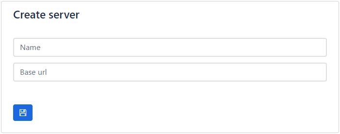
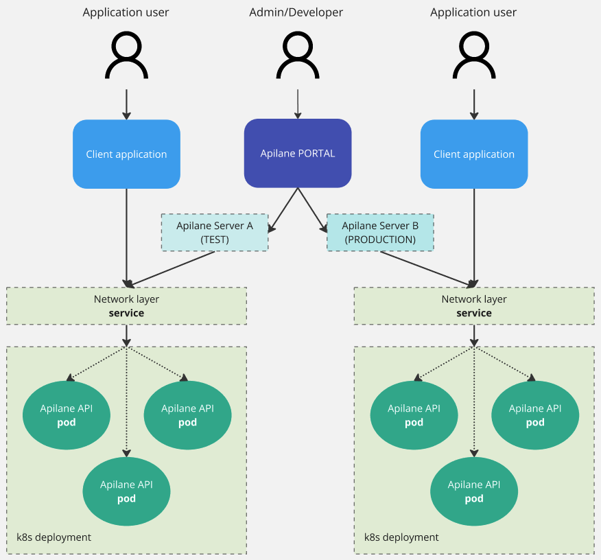

# Server

A `Server` is an Apilane concept that groups an `Apilane API` deployment.

## Create

A `Server` has a Url where the Portal and any client application can access the API.

## Sample setup

An `Apilane Instance` might consist of more than 1 servers. Let's assume the following setup on k8s as an example. This hypothetical instance consists of 2 `Servers` 1 used for testing and another 1 for production.

