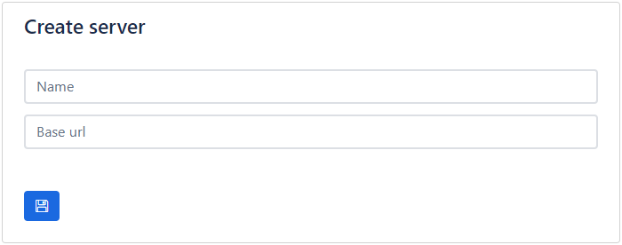
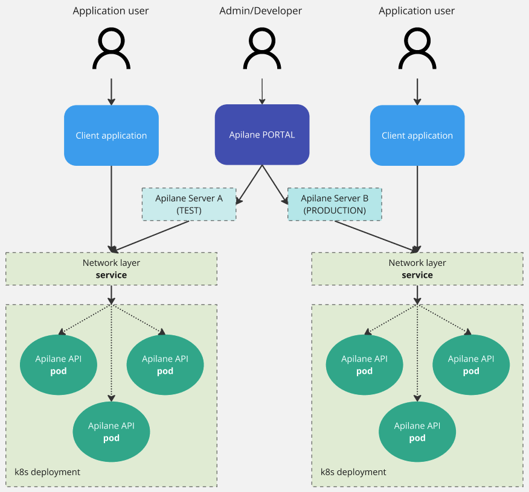

# Server

A `Server` is an Apilane concept that groups an `Apilane API` deployment. Each server represents a single running instance of the Apilane API service.

## What is a Server?

A Server defines the connection URL where the Portal and client applications can reach the API. When you create an application, you assign it to a specific Server — this determines which API instance will handle requests for that application.

| Property | Description |
|---|---|
| **Name** | A display name for the server (e.g., "Production", "Staging") |
| **URL** | The base URL where the API service is accessible (e.g., `https://api.example.com`) |

## Create

A `Server` has a URL where the Portal and any client application can access the API.

## Multiple servers

An `Apilane Instance` might consist of more than one server. This is useful for separating environments or scaling workloads:

| Use Case | Example Setup |
|---|---|
| **Environment separation** | One server for development/staging, another for production |
| **Geographic distribution** | Servers in different regions for lower latency |
| **Workload isolation** | Separate servers for different application groups |

### Example: Multi-server setup on Kubernetes

This hypothetical instance consists of 2 `Servers` — one used for testing and another for production.

Each server runs its own Apilane API container, but all servers are managed from a single Portal. Applications are assigned to a specific server at creation time.

## Relationship to applications

- Each **application** belongs to exactly **one server**
- Each **server** can host **multiple applications**
- The server is selected when creating an application and determines where the application's API endpoints are available
- Applications on different servers are completely independent — they have separate databases, file storage, and security configurations
