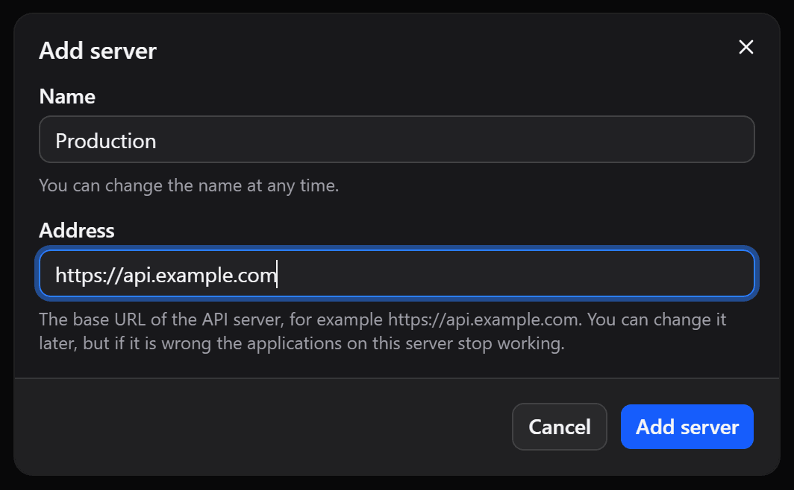
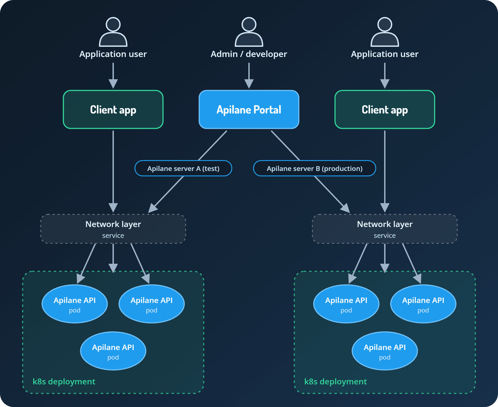

# Server

A `Server` is an Apilane concept that groups an `Apilane API` deployment. Each server is one deployment, reachable at one address. To run several deployments, for example one for testing and one for production, register each as a server of its own (see [Deployment](../deployment.md#multi-server-setup)).

## What is a Server?

A Server defines the connection URL where the Portal and client applications can reach the API. When you create an application, you assign it to a specific Server — this determines which API instance will handle requests for that application.

| Property | Description |
|---|---|
| **Name** | A display name for the server (e.g., "Production", "Staging") |
| **Address** | The base URL where the API service is accessible, http or https (e.g., `https://api.example.com`) |

## Create

Administrators add a server in the Portal under **Instance > Servers** with **Add server**. Its address is where the Portal, the browser of a Portal user and any client application can access the API.

## Edit and delete

Administrators change the name or the address of a server with the pencil (**Edit**) on its row. A new address takes effect at once for every application on the server, so a wrong one stops all of them from working in the Portal. A server that still hosts applications cannot be deleted; deleting one only removes it from the Portal, the deployment itself is not touched. The first server of an instance is created from the Portal's `ApiUrl` setting on its first start.

## Requirements

- The address is an `http` or `https` URL that the Portal can reach **and** that the browsers of Portal users can reach: the Portal UI calls the API server directly for records, files, history, statistics and email templates, so the server's CORS policy must stay open (see [Deployment](../deployment.md)).
- The `InstallationKey` setting of the API server must equal the key stored under **Instance > Settings** in the Portal. With another key the two cannot talk to each other.
- The dot next to a server's name in the Portal is a health check made from your browser: it is green when `{address}/health/liveness` answers and red when it does not.

## Multiple servers

An `Apilane Instance` might consist of more than one server. This is useful for separating environments or scaling workloads:

| Use Case | Example Setup |
|---|---|
| **Environment separation** | One server for development/staging, another for production |
| **Geographic distribution** | Servers in different regions for lower latency |
| **Workload isolation** | Separate servers for different application groups |

### Example: Multi-server setup on Kubernetes

This hypothetical instance consists of 2 `Servers` — one used for testing and another for production.

Each server runs its own Apilane API container, but all servers are managed from a single Portal. Applications are assigned to a specific server at creation time.

## Relationship to applications

- Each **application** belongs to exactly **one server**
- Each **server** can host **multiple applications**
- The server is selected when creating an application and determines where the application's API endpoints are available
- Applications on different servers are independent — they have separate databases and security configurations. The [file storage provider](file_storage_providers.md) is a setting of each API server (`FileStorage`), shared by all the applications on it
