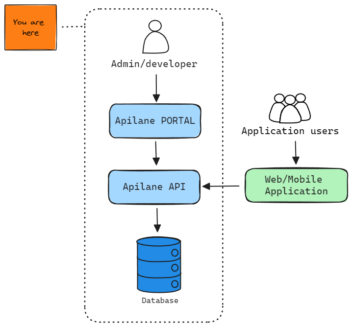

# Overview

## What Is Apilane?

Apilane is a backend platform that provides tools for developing and managing APIs for mobile and web client applications.
It offers features such as database management, user authentication, file storage and more, aiming to simplify backend development.



## Key Features

| Feature | Description |
|---|---|
| **Data Management** | Create entities and properties via the Portal. Full CRUD with [filtering, sorting, and paging](developer_guide/filtering_sorting.md). |
| **User Authentication** | Built-in registration, login, token management, password reset, and email confirmation. |
| **File Storage** | [Upload, download, and manage files](developer_guide/files.md) with access control and public file support. |
| **Role-Based Security** | Granular [access control](developer_guide/security.md) on entity, property, and custom endpoint level. |
| **Transactions** | [Atomic multi-operation transactions](developer_guide/transactions.md) with cross-referencing between operations. |
| **Custom Endpoints** | Run [custom SQL queries](developer_guide/custom_endpoints.md) as API endpoints with parameterized inputs. |
| **Aggregation & Stats** | Run aggregate functions (Count, Sum, Avg, Min, Max) and distinct queries on your data. |
| **Reports** | Build [visual reports](developer_guide/reports.md) (grids, pie charts, line charts) from the Portal. |
| **Email Templates** | Configurable [email templates](developer_guide/email_templates.md) for registration confirmation and password reset. |
| **Change Tracking** | Optional [entity history](developer_guide/entities_properties.md#change-tracking) to audit record changes over time. |
| **Schema API** | Retrieve your [application schema](api_reference.md#get-application-schema) programmatically at runtime. |
| **.NET SDK** | Type-safe [.NET SDK](developer_guide/sdk.md) with builder pattern for all API operations. |

## Why Apilane?

* **Rapid Development** — Pre-built backend services (authentication, data management, file storage) let you focus on your frontend.

* **Scalability** — Built on [Microsoft Orleans](https://github.com/dotnet/orleans) for distributed state management, ensuring your application remains responsive as it grows.

* **Simplicity** — Easy-to-use REST API and Portal UI. No backend expertise required.

* **Security** — Data encryption, role-based access control, IP allow/block lists, and sliding window rate limiting.

* **Storage Providers** — Out-of-the-box support for [SQLite](https://en.wikipedia.org/wiki/SQLite), [SQL Server](https://en.wikipedia.org/wiki/Microsoft_SQL_Server), [MySQL](https://en.wikipedia.org/wiki/MySQL) and [PostgreSQL](https://en.wikipedia.org/wiki/PostgreSQL).

## Quick Start

Execute the provided [docker-compose.yaml](assets/docker-compose.yaml) to spin up the Portal and API:

```bash
docker-compose -p apilane up -d
```

Access the Portal at [http://localhost:5000](http://localhost:5000) with the default credentials:

- **Email:** `admin@admin.com`
- **Password:** `admin`

For a complete walkthrough, follow the [Getting Started](getting_started.md) guide.
