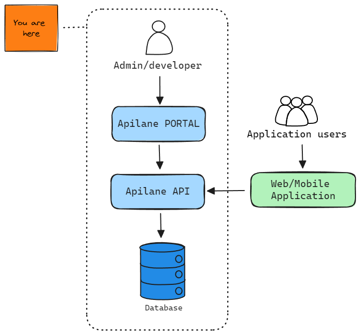

# Overview

## What Is Apilane?

Apilane is a backend platform that provides tools for developing and managing APIs for mobile and web client applications.
It offers features such as database management, user authentication, file storage and more, aiming to simplify backend development.

## Why Apilane?

* **Rapid Development**: Apilane provides pre-built backend services, such as user authentication, database management and file storage.
This eliminates the need to develop these functionalities from scratch, allowing developers to focus more on building and refining the frontend of their applications.

* **Scalability**: Apilane is designed to handle scalability challenges inherent in modern applications.
This scalability ensures that applications remain responsive and available even as they grow in popularity and usage.

* **Simplicity**: Apilane abstracts away the complexity of backend development by providing easy-to-use API.
Developers can quickly integrate backend services into their applications without needing extensive backend development expertise.

* **Security**: Apilane implements robust security measures, that is data encryption, access controls and rate limiting.

* **Storage providers**: Out of the box support for [Sqlite](https://en.wikipedia.org/wiki/SQLite), [SQLServer](https://en.wikipedia.org/wiki/Microsoft_SQL_Server) and [MySql](https://en.wikipedia.org/wiki/MySQL).

## Quick Start

Execute the following [docker-compose.yaml](assets/docker-compose.yaml) using the command `docker-compose -p apilane up -d` which will setup the Portal and the Api services on docker.
You may then access the portal on [http://localhost:5000](http://localhost:5000).

For more info follow our [getting started guide](getting_started.md).