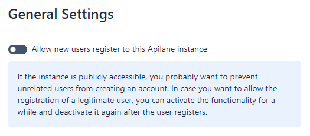
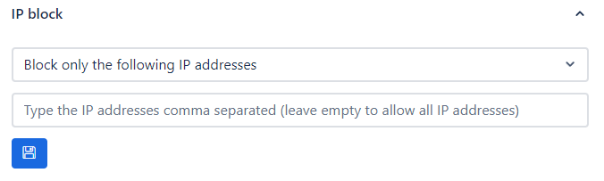
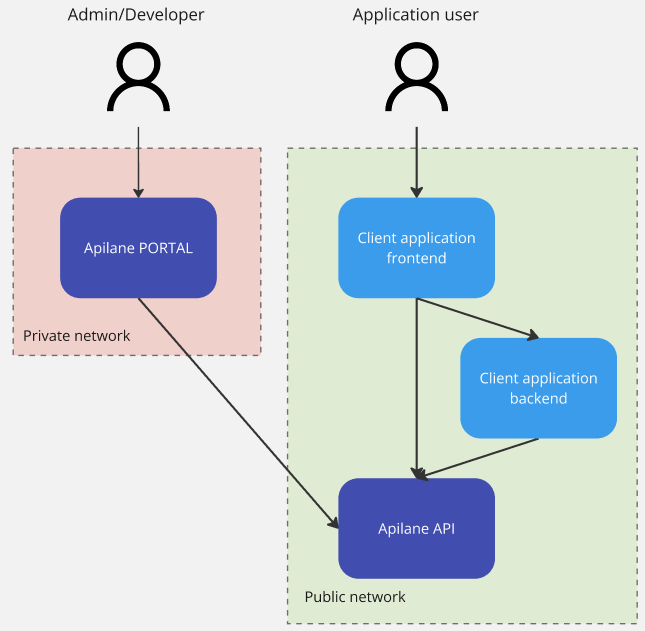
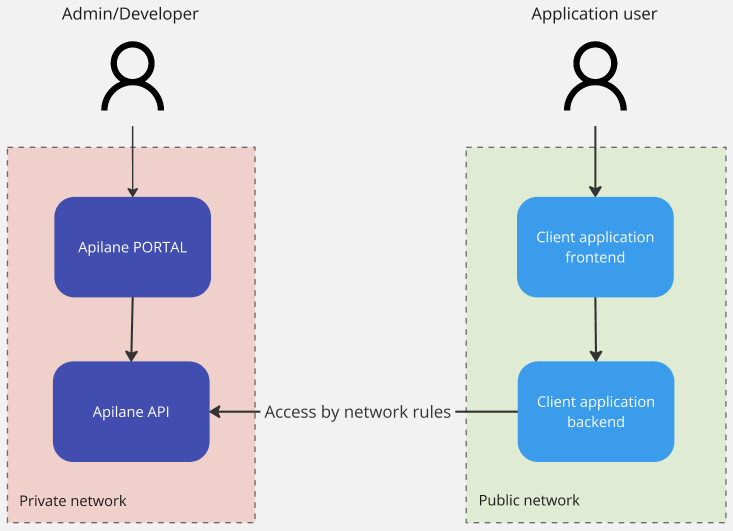
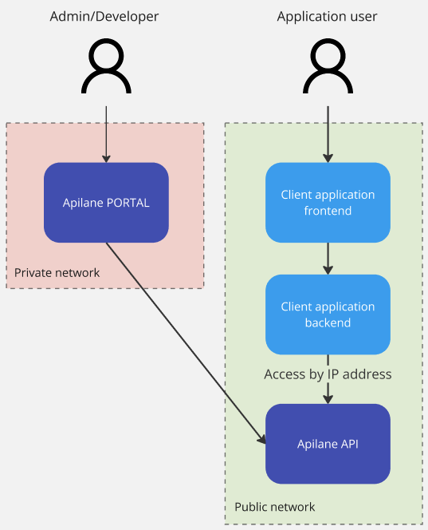

# Security considerations

An Apilane Instance consists of 2 deployments, the `Apilane Portal` and the `Apilane API`. Apilane Portal is a developer management tool and there is no need for client applications to have access to the Portal. Apilane API is the application server and should be accessible from the client application.

!!!warning "Malicious traffic"
    Apilane does not offer facilities for identifying malicious traffic towards the server such as DDoS attacks. This is a developer concern and should be taken into account for applications open to the internet.    
    
    What Apilane offers is rate limiting management per entity and action. Visit [rate limiting](/developer_guide/security/#rate-limiting) for more info.

## Apilane Portal

Access to the Portal should ideally be restricted to a private network. If that is not possible, you should disable new user registration from the instance settings (image below) to prevent unwanted users from registering to your Apilane Instance. 

!!!info "Note"
    You may temporarily enable user registration, to allow a valid user registration and disable again right after.

## Apilane API (Server)

#### IP allow/block
Any client application, web or mobile, should have access to the Apilane API, thus most of the times, the Apilane API server is publicly accessible. Depending on the nature of the client application, you can restrict access to the server by IP address on Application level. For more information visit [application IP allow/block](/developer_guide/security/#ip-allowblock).

#### Rate limiting

Navigate to rate [limiting section](/developer_guide/security/#rate-limiting) for more information on how rate limiting may increase application security.

## Sample setups

### Sample setup 1

### Sample setup 2

### Sample setup 3

