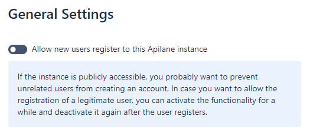
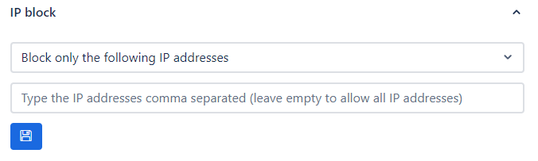
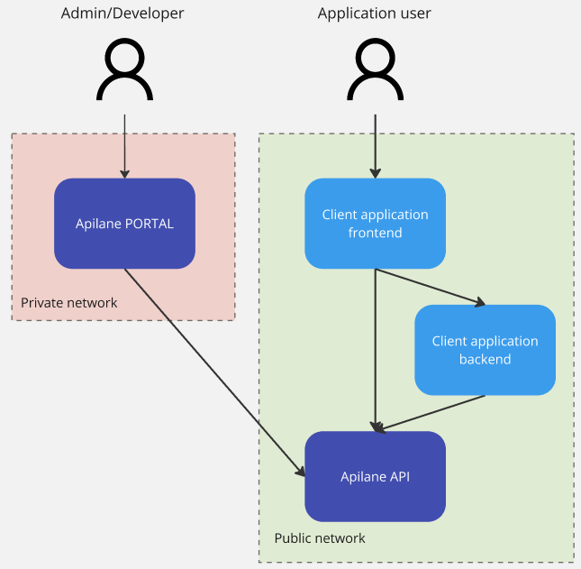
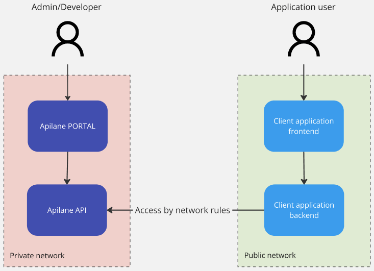
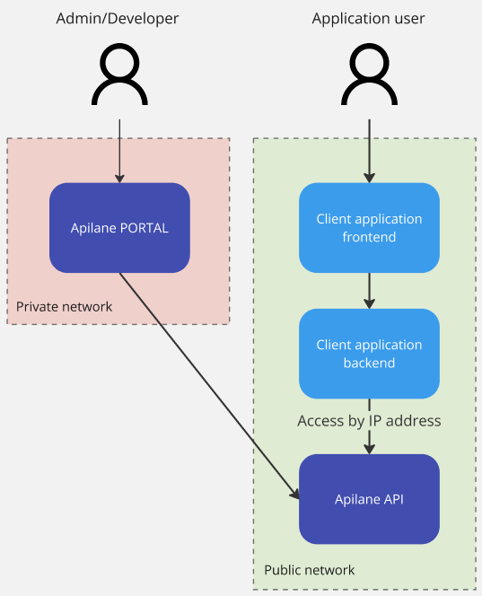

# Security considerations

An Apilane Instance consists of 2 deployments, the `Apilane Portal` and the `Apilane API`. The Portal is a developer management tool — client applications do **not** need access to it. The API is the application server and should be accessible from client applications.

!!!warning "Malicious traffic"
    Apilane does not offer facilities for identifying malicious traffic towards the server such as DDoS attacks. This is a developer concern and should be taken into account for applications open to the internet.

    What Apilane offers is rate limiting management per entity and action. Visit [rate limiting](/developer_guide/security/#rate-limiting) for more info.

---

## Apilane Portal

Access to the Portal should ideally be restricted to a private network. If that is not possible, you should disable new user registration from the instance settings (image below) to prevent unwanted users from registering to your Apilane Instance.

!!!info "Note"
    You may temporarily enable user registration, to allow a valid user registration and disable again right after.

### Portal authentication

The Portal uses ASP.NET Identity with cookie-based authentication (`Apilane.Portal.Identity`). Portal passwords require a minimum of 8 characters. Data protection keys are persisted to the `FilesPath` directory.

---

## Apilane API (Server)

### Application token

Every API request requires an **application token** — a GUID that identifies which application the request targets. This token is passed as a query parameter (`apptoken`) or in the request headers. While the token identifies the application, it does **not** authenticate the user.

!!!info "Token vs authentication"
    The application token is public and can be embedded in client code. User authentication is handled separately via auth tokens obtained through the login endpoint.

### Authentication tokens

When a user logs in, they receive an authentication token. This token:

- Expires after a configurable duration (`AuthTokenExpireMinutes`, set per application)
- Can be renewed via the `RenewAuthToken` endpoint before expiration
- Can optionally enforce single-session login (`ForceSingleLogin`) — each new login invalidates all previous tokens

### IP allow/block

Any client application, web or mobile, should have access to the Apilane API, thus most of the times, the Apilane API server is publicly accessible. Depending on the nature of the client application, you can restrict access to the server by IP address on Application level. For more information visit [application IP allow/block](/developer_guide/security/#ip-allowblock).

Two modes are available:

| Mode | Behavior |
|---|---|
| **Block only the following IPs** | All traffic is allowed except from listed IPs |
| **Allow only the following IPs** | All traffic is blocked except from listed IPs |

!!!warning "Important"
    These settings are not a replacement for network security tools. Use them as an additional security layer, not as the primary application security mechanism.

### Rate limiting

Navigate to the [rate limiting section](/developer_guide/security/#rate-limiting) for more information on how rate limiting may increase application security.

### Data encryption

Each application has an `EncryptionKey` that is generated at creation time. This key is used for encrypting sensitive data stored in the application database.

---

## Secure communication

The `InstallationKey` is a shared secret between the Portal and the API. It is used to validate that Portal-to-API communications are legitimate. Both services **must** use the same `InstallationKey` value.

!!!warning "Change the default"
    The default `InstallationKey` in the docker-compose example is a sample GUID. Always change this to a unique, random value in production deployments.

---

## Sample setups

### Sample setup 1

### Sample setup 2

### Sample setup 3

