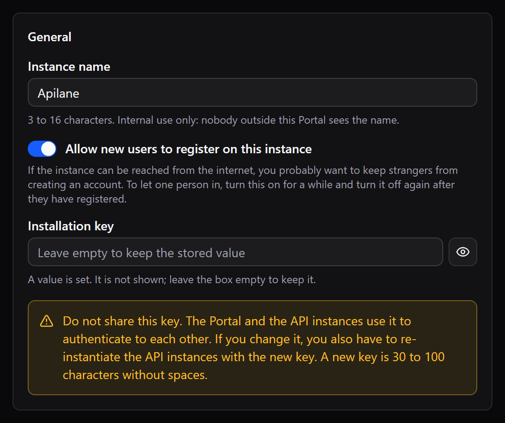
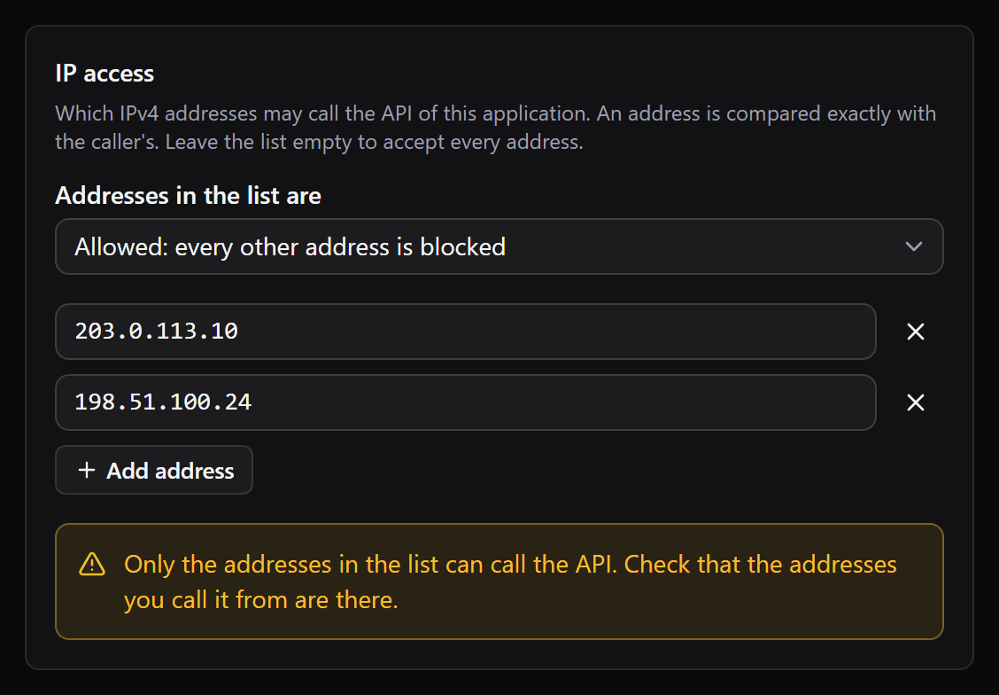
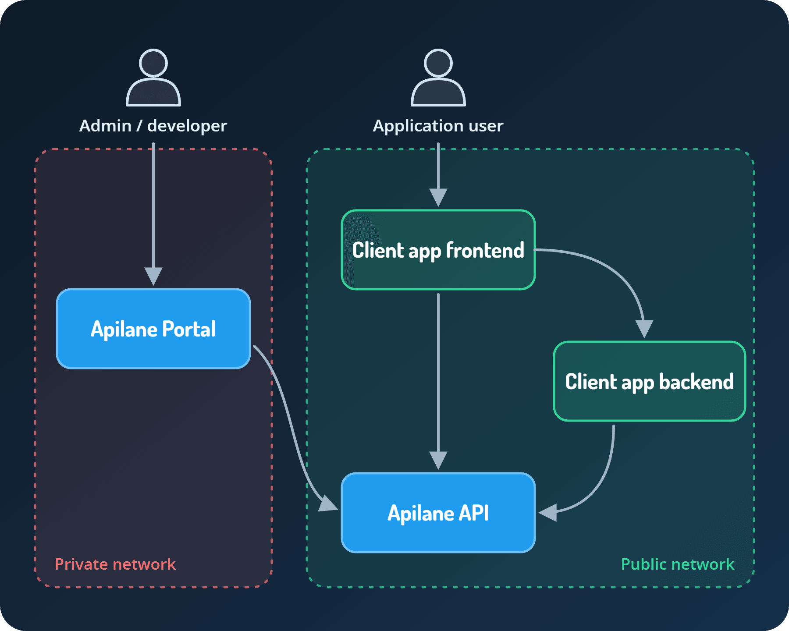
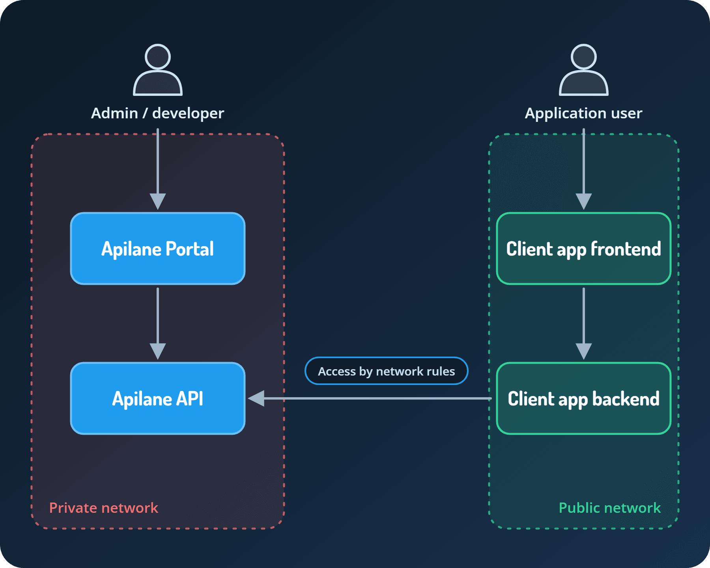
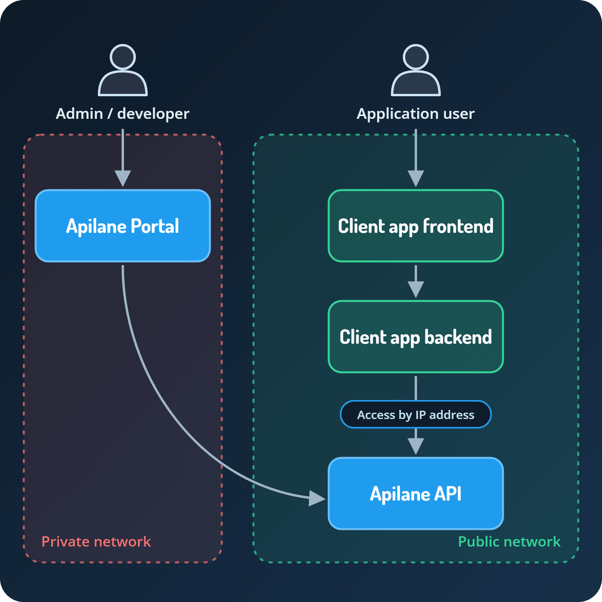

# Security considerations

An Apilane Instance consists of 2 deployments, the `Apilane Portal` and the `Apilane API`. The Portal is a developer management tool — client applications do **not** need access to it. The API is the application server and should be accessible from client applications.

!!!warning "Malicious traffic"
    Apilane does not offer facilities for identifying malicious traffic towards the server such as DDoS attacks. This is a developer concern and should be taken into account for applications open to the internet.

    What Apilane offers is rate limiting management per entity and action. Visit [rate limiting](developer_guide/security.md#rate-limiting) for more info.
    
    **Important:** Rate limiting is enforced per API server instance, not across the cluster. In multi-instance deployments, the effective rate limit is multiplied by the number of instances.

---

## Apilane Portal

Access to the Portal should ideally be restricted to a private network. If that is not possible, you should disable new user registration under **Instance > Settings** (the switch 'Allow new users to register on this instance', image below) to prevent unwanted users from registering to your Apilane Instance.

!!!info "Note"
    You may temporarily enable user registration, to allow a valid user registration and disable again right after.

If the Portal is not reachable by your end users, set a **Redirect URL** on the application's **Email** tab: without one, a user who confirms their email is sent to a page of the Portal (see [Email Templates](developer_guide/email_templates.md#confirmation-landing-page)).

### Portal authentication

The Portal uses ASP.NET Identity with cookie-based authentication (`Apilane.Portal.Identity`). Portal passwords require a minimum of 8 characters. Data protection keys are persisted to the `FilesPath` directory.

- A Portal user has one session at a time: signing in elsewhere ends the earlier session.
- A fresh instance requires administrator setup before any management or registration. The administrator uses
  the random temporary password from startup output to choose an email address and permanent password. Pending
  setup rotates the temporary password on restart; completed instances never do. Existing installations without
  a bootstrap record are marked complete without inspecting or changing their accounts or passwords.
- API-server checks of Portal permissions are not cached. Signing out, rotating a Portal token, or removing a
  collaborator takes effect at the next authorization check; the API needs the Portal to be reachable for it.
- Portal email links use the configured `PublicUrl` instead of the incoming Host header. Configure the public
  HTTPS origin when deploying behind a proxy; a wildcard listener without that setting cannot generate email links.
- Administrator setup, sign in, sign up and the password-reset request together allow 30 calls per minute per client address. Behind a reverse proxy see [Production considerations](deployment.md#production-considerations).
- Secrets (connection strings, mail passwords, the installation key) are never shown again once they are saved; an empty box keeps the stored value.
- An application's owner can share it with other Portal users. A collaborator can do everything the owner can, except sharing.
- Scripts and AI agents use an **agent key** (`Authorization: Bearer apl_...`) instead of a session. An administrator adds the agent under **Instance > Agents**; its key is shown once and the Portal stores only a hash of it. A key has no expiry date, and wrong keys are not counted or slowed down, so keep it secret and delete the agent to revoke it. An agent is refused every delete, everything under **Instance** and the encryption key of an application. See [AI Agent Guidelines for the Portal](developer_guide/ai_agent_portal.md).
- The database backup (**Instance > Settings**) holds every secret of the instance, so store it like one. Every download is written to the audit log.

### File storage credentials

When using cloud file storage providers (Google Cloud Storage, AWS S3, Azure Blob Storage), proper credential management is critical:

- **Never commit credentials** to source control (service account JSON files, access keys, connection strings)
- **Use secrets management**: Docker secrets, Kubernetes secrets, or cloud-native secret managers (AWS Secrets Manager, Azure Key Vault, GCP Secret Manager)
- **Rotate credentials regularly**: Establish a credential rotation policy and update secrets without service downtime
- **Least privilege**: Grant only the minimum required permissions (`s3:GetObject`, `s3:PutObject`, `s3:DeleteObject` for S3; Storage Object Admin for GCS; Blob Data Contributor for Azure)
- **Static credentials only**: the providers take an access key pair, a service account JSON file or a connection string. Managed identities (IAM roles, Workload Identity, Azure Managed Identity) are not supported, so scope each credential to the one bucket or container

See [File Storage Providers](developer_guide/file_storage_providers.md) for provider-specific credential configuration examples.

---

## Apilane API (Server)

### Application token

Every API request requires an **application token** — a GUID that identifies which application the request targets. This token is passed as the query parameter `appToken` or in the `x-application-token` header. While the token identifies the application, it does **not** authenticate the user.

!!!info "Token vs authentication"
    The application token is public and can be embedded in client code. User authentication is handled separately via auth tokens obtained through the login endpoint.

### Authentication tokens

When a user logs in, they receive an authentication token. This token:

- Expires after a configurable period of **inactivity** (`AuthTokenExpireMinutes`, set per application) — a request made after more than a tenth of that time has passed since the token was last extended extends it again, so a token expires after about this time of inactivity (at least 90% of it)
- Can be renewed via the `RenewAuthToken` endpoint before expiration
- Can optionally enforce single-session login (`ForceSingleLogin`) — each new login invalidates all previous tokens
- A successful password change or password reset revokes all existing sessions and outstanding reset links.
  This includes bearer tokens and cached signed-request credentials. `Account/Logout?everywhere=true` also
  revokes all existing sessions; sign in again afterwards.

### IP allow/block

Any client application, web or mobile, should have access to the Apilane API, thus most of the times, the Apilane API server is publicly accessible. Depending on the nature of the client application, you can restrict access to the server by IP address on Application level. For more information visit [application IP allow/block](developer_guide/security.md#ip-allowblock).

Two modes are available (the choice 'Addresses in the list are' on the **Security** tab of the application):

| Mode | Behavior |
|---|---|
| **Blocked: every other address is accepted** | All traffic is allowed except from listed IPs |
| **Allowed: every other address is blocked** | All traffic is blocked except from listed IPs |

!!!warning "Important"
    These settings are not a replacement for network security tools. Use them as an additional security layer, not as the primary application security mechanism.

    The address is read from the first entry of the `X-Forwarded-For` header when the request carries one, otherwise from the connection. Apilane cannot tell whether a proxy set that header, so the list only means something when the API can be reached **only** through a proxy or load balancer that overwrites `X-Forwarded-For` with the address it saw. If the API is reachable directly, any caller can send the header and pick an address.

### Rate limiting

Navigate to the [rate limiting section](developer_guide/security.md#rate-limiting) for more information on how rate limiting may increase application security.

!!!info "Multi-instance deployments"
    Rate limiting counters are maintained in-memory on each API server instance independently. In deployments with multiple API instances (e.g., Kubernetes with horizontal scaling), each instance enforces its own rate limits. The aggregate rate limit across all instances is approximately the configured limit multiplied by the number of instances.

### Data encryption

Each application has an `EncryptionKey` (8 characters, generated at creation) that encrypts the `Password` of application users and every property marked **Encrypted**. This is reversible encryption (DES in ECB mode), not a password hash: whoever has both the application database and the key can read those values. Treat the Portal database, its backup (**Instance > Settings**) and the **Info** dialog of an application, which can show the key to its owner and collaborators, as secrets.

---

## What to expose

- **API**: client applications need only the API calls, but `/swagger`, `/metrics`, `/Version` and `/health/*` also answer without authentication on the same port. If the API is public, consider blocking `/metrics` (and `/swagger`) at the reverse proxy.
- **Portal**: keep it on a private network. `/api/internal` is for the API servers only (it needs the installation key) and `/metrics` answers without authentication, so when the Portal is public a proxy may block both from outside.

---

## Secure communication

The `InstallationKey` is a shared secret between the Portal and the API. It authenticates the calls in both directions: the API to the Portal, and the Portal to the API when it creates, imports or clones an application. The API servers **must** use the key the Portal holds (on a new installation, the same `InstallationKey` value as the Portal).

!!!warning "Use a unique key"
    The docker-compose example reads the key from `APILANE_INSTALLATION_KEY` and does not start without it, but the committed `appsettings.json` holds a placeholder: a service started without its own value still starts and only logs a `SECURITY` warning, and a Portal that was first started with the placeholder stores that publicly known key. Use a long random value, never one published in documentation or a public repository, and check the log of both services after the first start; they log a `SECURITY` warning at startup when they detect such a value. The Portal uses the key stored in its database (**Instance > Settings**); its own `InstallationKey` setting only seeds it on first start. To change it on an existing installation, update it there, set the same value as the API servers' `InstallationKey` and restart the API servers. The Portal does not need a restart. Until the API servers run with the new key, the Portal and the API servers refuse each other's calls.

---

## Sample setups

The API servers must reach the Portal (`PortalUrl`), and the browsers of Portal users must reach every API server (the address under **Instance > Servers**); the diagrams leave these two connections out.

### Sample setup 1

The Portal is private. The API is public: the client app's frontend and backend both call it.

### Sample setup 2

Both services are private. The client app's backend reaches the API through network rules.

### Sample setup 3

The API is public, but only the client app's backend may call it, by IP address (see [IP allow/block](#ip-allowblock) and the warning about `X-Forwarded-For` there).
